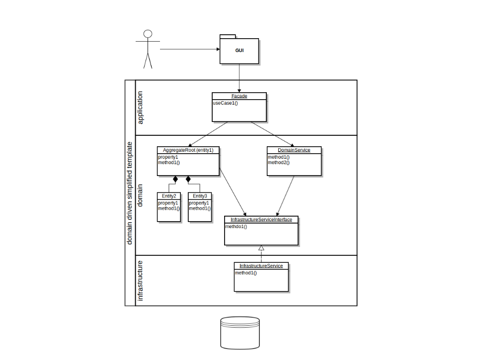
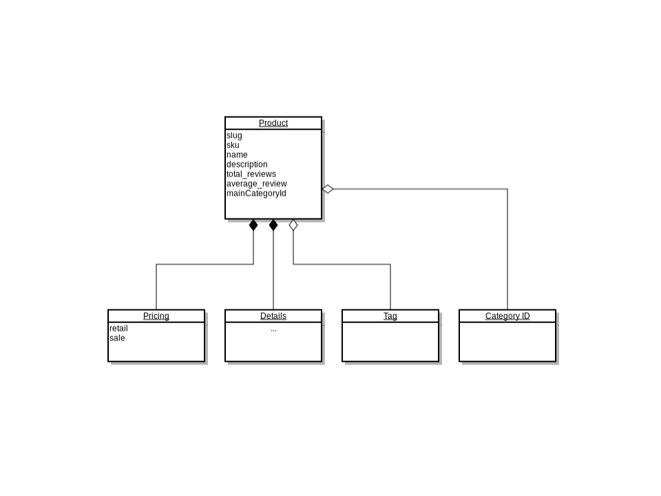
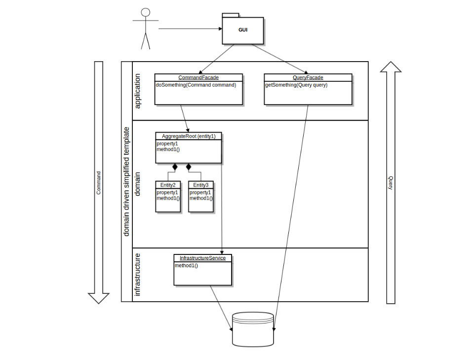
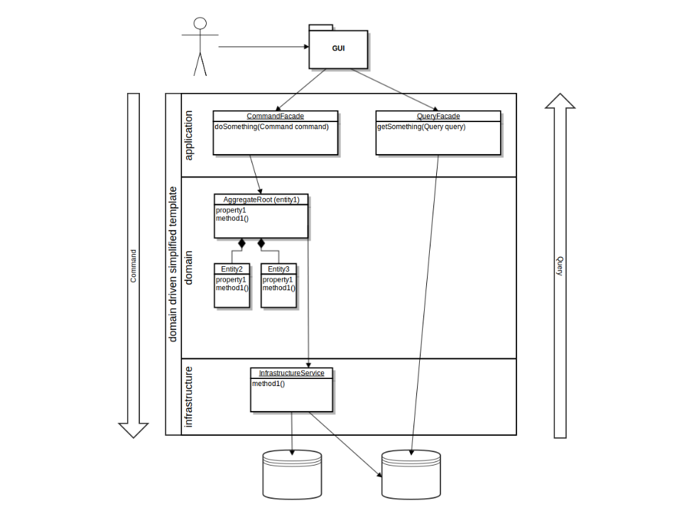

class: center, middle

# Domain Driven Design

by Jakub Nabrdalik

---


## Domain Driven Design

--

Software design approach described by Eric Evans in his book "Domain-Driven Design: Tackling Complexity in the Heart of Software"

Placing the project's primary focus on the core domain and domain logic

Focuses complex designs on a model of the domain

Initiating a creative collaboration between technical and domain experts to iteratively refine a conceptual model that addresses particular domain problems

---

## Domain model

> A domain model is not a particular diagram; it is the idea that the diagram is intended to convey. It is not just the knowledge in a domain expert’s head; it is a rigorously organized and selective abstraction of that knowledge. A diagram can represent and communicate a model, as can carefully written code, as can an English sentence.

--

Focus on domain, the business problem to solve, and deal with its complexity

Make architecture fit the domain by reflecting the domain in the code

One should be able to learn a lof about the domain from the code

> When software fits/reflects the domain, it reacts well to change over time

---

## Model is JUST a model

We need to organize information

Real life is too complex

We decide what to leave out, what to take and from which perspective

What to simplify, what to dig deeper

Good model helps understand and collaborate

śLive is so complex we may need several models, from different perspectives

---

## Ubiquitous language

The language to communicate the model

Two levels of design:
- software design (architecture)
- code design (modelling)

--

Waterfall = one way communication

XP / Agile = two way communication


It used to be, that the terminology of day-to-day discussions was disconnected from the terminology embedded in the code, even in writing

Use the language based on the model, to communicate both in speach and in code

---

## Communication changes

--

> Any technical person contributing to the model must spend some time touching the code, whatever primary role he or she plays on the project. Anyone responsible for changing code must learn to express a model through the code. 

--

> Every developer must be involved in some level of discussion about the model and have contact with domain experts. 

--

> Those who contribute in different ways must consciously engage those who touch the code in a dynamic exchange of model ideas through the Ubiquitous Language.

--

> Design a portion of the software system to reflect the domain model in a very literal way, so that mapping is obvious. 

--

> Revisit the model and modify it to be implemented more naturally in software, even as you seek to make it reflect deeper insight into the domain.

---

## Bounded Context

Bounded Context vs single Canonical Model

--

> In those younger days we were advised to build a unified model of the entire business, but DDD recognizes that we've learned that "total unification of the domain model for a large system will not be feasible or cost-effective"

> So instead DDD divides up a large system into Bounded Contexts, each of which can have a unified model - essentially a way of structuring MultipleCanonicalModels.

> [http://martinfowler.com/bliki/BoundedContext.html]

---

## Stop modelling data

Problems with relational DB & Modelling

- single model way too big
- only one model vs different perspectives
- things discovered when we write code, will be lost
- not practical to implement in code
- OOP hates cycles, loves tree structures

--

Model behaviour, not data!

OOP is natural choice for most domains when using DDD, because it fits business concepts (and organizations) better than FP and PP. But be aware of when the domain fits better with FP (mathematics, phisics, etc.)

---

class: center, middle

# Domain Driven Design

# Building blocks

---

## Layers

UI -> Application -> Domain -> Infrastructure

If domain is mixed with other layers

- testing is awkward or hard
- business logic is cluttered
- hard to change / refactor

---



---

UI -> Application -> Domain -> Infrastructure

## Application

- coordinates activity
- does not contain business logic
- no state of business objects
- can have state of app task progress
- entry point to use cases

---

UI -> Application -> Domain -> Infrastructure

## Domain

- this is where the modelling takes place
- 1:1 ubiquitous language language
- split into smaller pieces (bounded contexts)

---

UI -> Application -> Domain -> Infrastructure

## Infrastructure Layer

- think: supporting library
- gore details of technical stuff
- persistance, I/O, etc.

---

## Building blocks

---

## Entity - has identity

--

> An object that is not defined by its attributes, but rather by a thread of continuity and its identity.
Example: Most airlines distinguish each seat uniquely on every flight. Each seat is an entity in this context. However, Southwest Airlines, EasyJet and Ryanair do not distinguish between every seat; all seats are the same. In this context, a seat is actually a value object.

---

## Value Object

--

- no identity
- exchangeable
- immutable
- throw away
- not only DTOs (have logic)

> An object that contains attributes but has no conceptual identity. They should be treated as immutable.
Example: When people exchange business cards, they generally do not distinguish between each unique card; they only are concerned about the information printed on the card. In this context, business cards are value objects.

---

## Services

--

- verbs that do not fit into any object
- stateless
- operation that refers to other objects
- think: functions, like Money Transfer

> When an operation does not conceptually belong to any object. Following the natural contours of the problem, you can implement these operations in services. See also Service (systems architecture).

--

There are different types of services

- domain services
- infrastructure services
- application services (facades)

---

## Aggregate

--

- a group of associated entities
- tree structure
- Root Aggregate encapsulates them
- root ensures invariants
- no access except for the root
- root has a global identity
- you can hold a reference to the root only
- usually eager loaded

> A collection of objects that are bound together by a root entity, otherwise known as an aggregate root. The aggregate root guarantees the consistency of changes being made within the aggregate by forbidding external objects from holding references to its members.

---



---

## Factory

--

- responsible for creating aggregates
- because aggregates are too complex to create in constructor
- because to create an entity we may need to coopeare with others

> Methods for creating domain objects should delegate to a specialized Factory object such that alternative implementations may be easily interchanged.

---

## Repositories

- all the logic to obtain an object
- can be DB, can be file, can use other service

> Methods for retrieving domain objects should delegate to a specialized Repository object such that alternative storage implementations may be easily interchanged.


---

## Bounded Context

> The setting in which a word or statement appears that determines its meaning


---

## how Bounded Contexts communicate

Different models need to be mapped

Or do they?

Options

- Shared kernel + CI
- Customer - Supplier
- Conformist
- Anticorruption Layer
- Separate Ways
- Open Host Service
- Events (no direct communication)

---

## CQRS

Command Query Responsibility Segregation

A pattern of getting the data out, without pushing it through Domain

No setters/getters on your domain objects anymore!

Works well with and without Event Sourcing.

---



---



---
## Two entities based on a signle DB

```java
@Document(collection = MongoCollections.ARTICLES)
class Article  {...}

@Getter @Document(collection = MongoCollections.ARTICLES)
public class ArticleQueryDto {
    //Mapping only data I want to share
}
```

```
article/
├── ArticleQueryEndpoint.java
└── query
    ├+─ ArticleQueryDto.java
    ├+─ ArticleQueryRepository.java
    └+─ ArticleSearchParams.java
```

You can also use JPQL to load DTO directly

```java
@Query("SELECT NEW com.company.PublisherInfo(pub.id, pub.revenue, mag.price) " + 
    "FROM Publisher pub JOIN pub.magazines mag WHERE mag.price > ?1")
PublisherInfo findByEmailAddress(BigDecimal price);
```

---

## DB Trigger

Homogenous DBs

Trigger DB specifc

---

## Event publishing

Two different stores

```java
@Transactional
void withdraw(UUID cardId, BigDecimal amount) {
	CreditCard creditCard = creditCardRepository.findById(cardId)
       	.orElseThrow(() -> new IllegalStateException("Cannot find card with id " + cardId));
	creditCard.withdraw(amount);
	domainEventPublisher.publish(new CardWithdrawn(cardId, amount));
}

@Scheduled(fixedRate = 2000)
@Transactional
void publishExternally() {
    domainEventStorage
        .findAllBySentOrderByEventTimestampDesc(false)
        .forEach(event -> {
            Map<String, Object> headers = new HashMap<>();
            headers.put("type", event.getEventType());
            source.output().send(new GenericMessage<>(event.getContent(), headers));
            event.sent();
        });
}
```

> https://github.com/ddd-by-examples/all-things-cqrs/blob/master/with-events/with-events-source
