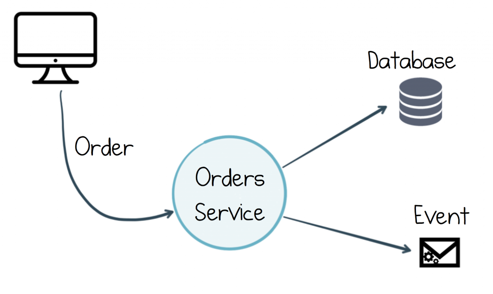
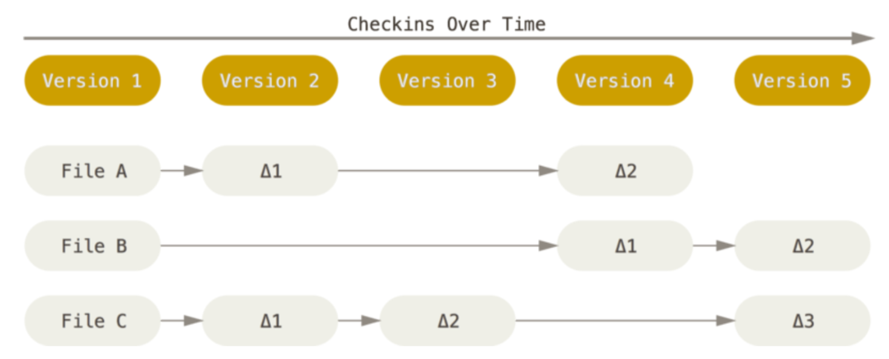
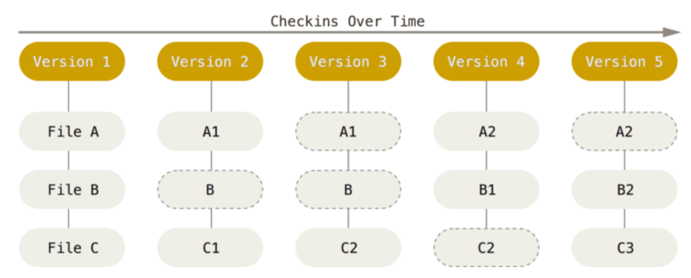
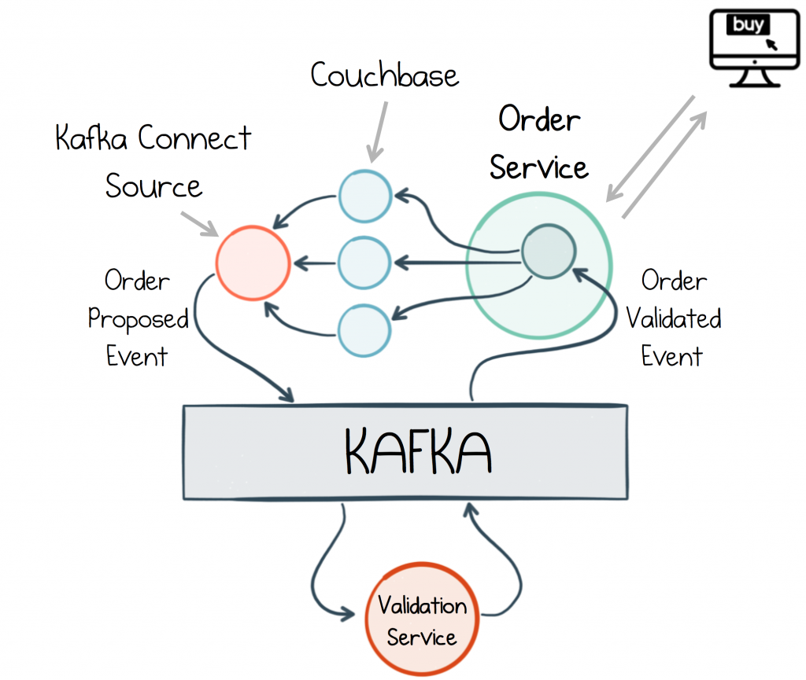

class: center, middle

# Event sourcing

---

https://www.confluent.io/blog/messaging-single-source-truth/
https://www.confluent.io/blog/event-driven-2-0

> [With] ‘traditional’ event-driven systems, each service typically listens to events, records its actions in a database, and raises new events

> In this case, the database is the source of truth. That makes sense from the internal perspective of the Orders service. 

---

Events as
 
- whole facts (an Order, in its entirety) 
- ‘deltas’ that must be re-combined 

> (a whole Order message, followed by messages denoting just the state changes: “amount updated to $5”, “order cancelled” etc)

--

Does SVN use whole facts or deltas? Why?

--

How does Git store commits? Why?

---

> The major difference between Git and any other VCS (Subversion and friends included) is the way Git thinks about its data. Conceptually, most other systems store information as a list of file-based changes. 

> These systems (CVS, Subversion, Perforce, Bazaar, and so on) think of the information they keep as a set of files and the changes made to each file over time.

---

> Git doesn’t think of or store its data this way. Instead, Git thinks of its data more like a set of snapshots of a miniature filesystem. Every time you commit, or save the state of your project in Git, it basically takes a picture of what all your files look like at that moment and stores a reference to that snapshot. To be efficient, if files have not changed, Git doesn’t store the file again, just a link to the previous identical file it has already stored. Git thinks about its data more like a stream of snapshots.

> [Pro Git: Scott Chacon, Ben Straub]

---

The essence of event sourcing is the former approach: the current state is derived.

---

## Change Data Capture

How do DBs store data (inserts, updates, etc.)?

--

---

## Change Data Capture

> One of the most useful applications of Change Data Capture is in migrating from an old architecture to a new one. In reality, most projects have an element of legacy and renewal, and while there is a place for big-bang redesigns, incremental change is typically an easier pill to swallow.

---

## Creating Materialized Views

for datasets that
- fit in memory and
- can be loaded in a reasonable amount of time

> To reduce the load time issue it’s useful to keep a snapshot of the event log using a compacted topic