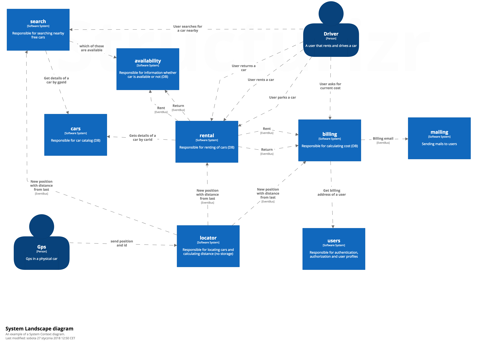

class: center, middle

# Hexagonal Architecture

## a.k.a. Ports & Adapters

by Jakub Nabrdalik

---

## Hexagonal architecture 

a.k.a. "Ports & Adapters"

> Allow an application to equally be driven by users, programs, automated test or batch scripts, and to be developed and tested in isolation from its eventual run-time devices and databases.

> [http://alistair.cockburn.us/Hexagonal+architecture]


---

class: center, middle

## Test too low

(unit testing methods & classes)


class api change, refactoring or a new feature == lots of unrelated tests break

100% coverage and it doesn't work on production anyway (testing the implementation, not system behavior)

---

class: center, middle

## Test too high

(system as a whole, via UI or API)


empty spring context = 3.5s; microservice with embedded mongo = 22s
 
whole test suite of an app = 45min

---

## How much time do I have?

Usability Engineering, Jakob Nielsen , 1993

--

"**1.0** second is about the limit for the user's **flow of thought** to stay uninterrupted"

--

"**10 seconds** is about the limit for keeping the user's **attention** focused on the dialogue. For longer delays, users will want to perform other tasks while waiting for the computer to finish"

--

After **30 seconds** mark, devs run tests **only on push** (Sabre, 2010)

--

Brand new (empty) spring boot app takes **7 seconds to start an integration** test on my MacBook Pro

--

Serious domain microservice with in-memory DB (Fongo/H2) takes **22 sec to start an integration test**

---

## Test your modules



---

## What's a module?

A module encapsulates its data (access only via API)

A module has clerly defined collaborators and APIs

Has (almost) all layers (vertical slicing)

Very much like a microservice candidate

Most likely a Bounded Context (words have their own definitions/classes)


---

## Test your modules

as black boxes

all flows and corner cases in milliseconds (no I/O)

add crucial-paths-that-bring-money with I/O

---


## Writing new system

--

### step 1: gathering requirements

--

For a video rental store we want to create a system for managing the rental administration.
We want three primary functions.
- Have an inventory of films
- Calculate the price for rentals
- Keep track of the customers “bonus” points

Price
The price of rentals is based type of film rented and how many days the film is rented for....

(a whole lot of other requirements)

---

### step 2: requirements as a behavioral spec & scenarios

```
As a hipster-deviant, to satisfy my weird desires, I want to:

given inventory has an old film "American Clingon Bondage" and a new release of 
"50 shades of Trumpet"

when I go to /films then I see both films

when I go to /points then I see I have no points

when I post to /calculate with both films for 3 days then I can see it will cost 
me 120 SEK for Trumpet and 90 SEK for Clingon

when I post to /rent with both firms for 3 days then I have rented both movies

when I go to /rent then I see both movies are rented

when I go to /points then I see I have 3 points

when I post to /return with Trumper then trumper is returned

when I go to /rent then I see only Clingon is rented
```
---

### step 3: requirements as acceptance spec

```groovy
class AcceptanceSpec extends IntegrationSpec {
    def "positive renting scenario"() {
        given: 'inventory has an old film "American Clingon Bondage" and a new release of "50 shades of Trumpet"'

        when: 'I go to /films'
        then: 'I see both films'

        when: 'I go to /points'
        then: 'I see I have no points'

        when: 'I post to /calculate with both films for 3 days'
        then: 'I can see it will cost me 120 SEK for Trumpet and 90 SEK for Clingon'

        when: 'I post to /rent with both firms for 3 days'
        then: 'I have rented both movies'

        when: 'I go to /rent'
        then: 'I see both movies are rented'

        when: 'I go to /points'
        then: 'I see I have 3 points'

        when: 'I post to /return with Trumper'
        then: 'trumper is returned'

        when: 'I go to /rent'
        then: 'I see only Clingon is rented'
    }
}
```

---

### step 4: architecture 

**Design Bounded Contexts and communication:**


---

### Start unit testing the module via API

```groovy
class FilmSpec extends Specification {
    FilmFacade facade = new FilmConfiguration().filmFacade()
```
--
```groovy
    FilmDto trumper = createFilmDto("50 shades of Trumpet", FilmTypeDto.NEW)
    FilmDto clingon = createFilmDto("American Clingon Bondage", FilmTypeDto.OLD)
```

--
```groovy
    def "should get a film"() {
        when: "we add a film"
            facade.add(trumper)

        then: "system has this film"
            facade.show(trumper.title) == trumper
    }
```
---
```groovy
    def "shoud list films"() {
        given: "we have two films in system"
            facade.add(trumper)
            facade.add(clingon)

        when: "we ask for all films"
            Page<FilmDto> foundFilms = facade.find(new PageRequest(0, 10))

        then: "system returns the films we have added"
            foundFilms.contains(trumper)
            foundFilms.contains(clingon)
    }

    private FilmDto createFilmDto(String title, FilmTypeDto type) {
        return FilmDto.builder().title(title).type(type).build()
    }
}
```

--

Add all the corner cases

---

### GREEN + REFACTOR

```Bash
ls  classic/src/main/java/eu/solidcraft/film/

Film.java                   
FilmCreator.java            
FilmType.java
FilmConfiguration.java      
FilmFacade.java             
InMemoryFilmRepository.java
```

---

```Java
class InMemoryFilmRepository {
    private ConcurrentHashMap<String, Film> map = new ConcurrentHashMap();

    Film save(Film film) {
        requireNonNull(film);
        map.put(film.dto().getTitle(), film);
        return film;
    }

    Film findOneOrThrow(String title) {
        Film film = map.get(title);
        if(film == null) {
            throw new FilmNotFoundException(title);
        }
        return film;
    }

    void delete(String title) {
        map.remove(title);
    }

    Page<Film> findAll(Pageable pageable) {
        List<Film> films = new ArrayList<>(map.values());
        return new PageImpl<>(films, pageable, films.size());
    }

    class FilmNotFoundException extends RuntimeException {
        public FilmNotFoundException(String title) {
            super("No film of title \"" + title + "\" found", null, false, false);
        }
    }
}
```

---

### Module configuration so far

```java
class FilmConfiguration {

    FilmFacade filmFacade() {
        FilmRepository filmRepository = new InMemoryFilmRepository();
        FilmCreator filmCreator = new FilmCreator();
        return new FilmFacade(filmRepository, filmCreator);
    }
}
```

That was fast & easy

Runs in milliseconds

We have validated whether the idea makes sense 

We have the core of the code done well

We can add as many corner cases as we want

Now let's add IO

---

### Add Integration spec

```Java
class FilmControllerAcceptanceSpec extends IntegrationSpec implements SampleFilms {
    @Autowired FilmFacade filmFacade

    @WithMockUser
    def "should get films"() {
        given: 'inventory has two films'
            filmFacade.add(trumper, clingon)

        when: 'I go to /films'
            ResultActions getFilms = mockMvc.perform(get("/films"))
        then: 'I see both films'
            getFilms.andExpect(status().isOk())
                .andExpect(content().json("""
                {
                    "content": [
                        {"title":"$clingon.title","type":"$clingon.type"},
                        {"title":"$trumper.title","type":"$trumper.type"}
                    ]
                }"""))

        when: 'I go to /film/'
            ResultActions getFilm = mockMvc.perform(get("/film/$clingon.title"))
        then: 'I see details of that film'
            getFilm.andExpect(status().isOk())
                .andExpect(content().json("""                        
                    {"title":"$clingon.title","type":"$clingon.type"}"""))
    }
}
```

---

### Add IO

```Java
@RestController
@AllArgsConstructor
class FilmController {
    private FilmFacade filmFacade;

    @GetMapping("films")
    Page<FilmDto> getFilms(Pageable pageable) {
        return filmFacade.findAll(pageable);
    }

    @GetMapping("film/{title}")
    FilmDto getFilm(@PathVariable String title) {
        return filmFacade.show(title);
    }
}
```

```Java
interface FilmRepository extends Repository<Film, String> {
    Film save(Film film);
    Film findOne(String title);
    void delete(String title);
    Page<Film> findAll(Pageable pageable);
}
```

---

### IO Configuration

```java
@Configuration
class FilmConfiguration {

    FilmFacade filmFacade() {
        return filmFacade(new InMemoryFilmRepository());
    }

    @Bean
    FilmFacade filmFacade(FilmRepository filmRepository) {
        FilmCreator filmCreator = new FilmCreator();
        return new FilmFacade(filmRepository, filmCreator);
    }
}
```

---

## Do not let the IO out

What will happen if you require Mocks/Stubs for IO, by giving developers this method for unit tests?

--

```java
@Bean
FilmFacade filmFacade(FilmRepository filmRepository) {
    FilmCreator filmCreator = new FilmCreator();
    return new FilmFacade(filmRepository, filmCreator);
}
```

--

```java
InMemoryFilmRepository filmRepository = Mock()
//or
InMemoryFilmRepository filmRepository = new InMemoryFilmRepository()
...
FilmFacade filmFacade = new FilmConfiguration().filmFacade(filmRepository)
```

People will test via verifying on IO (repository mock/stub, etc.), because they have it at hand

This will check internal state of the module, instead of testing the behaviour

---

## Why is Hexagonal Architecture so important?

--

Most teams have too long feedback loop

--

Most teams are slow to experiment

--

Most developers focus on infrastructure

--

Infrastructre does not bring advantage for most businesses

--

Development is a learning process (a wicked problem)

--

We need fast feedback, fast experiments, good modelling


