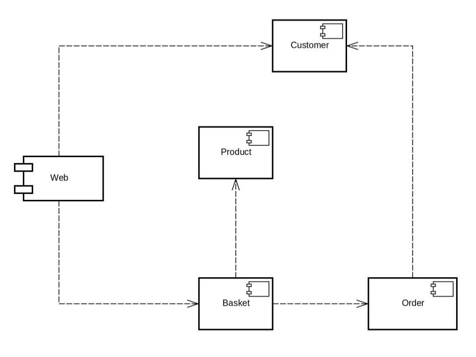
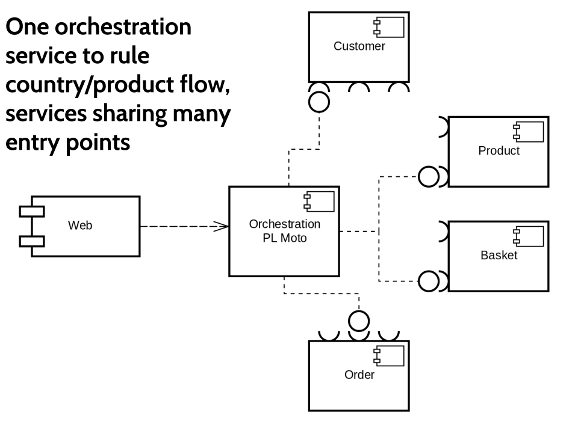
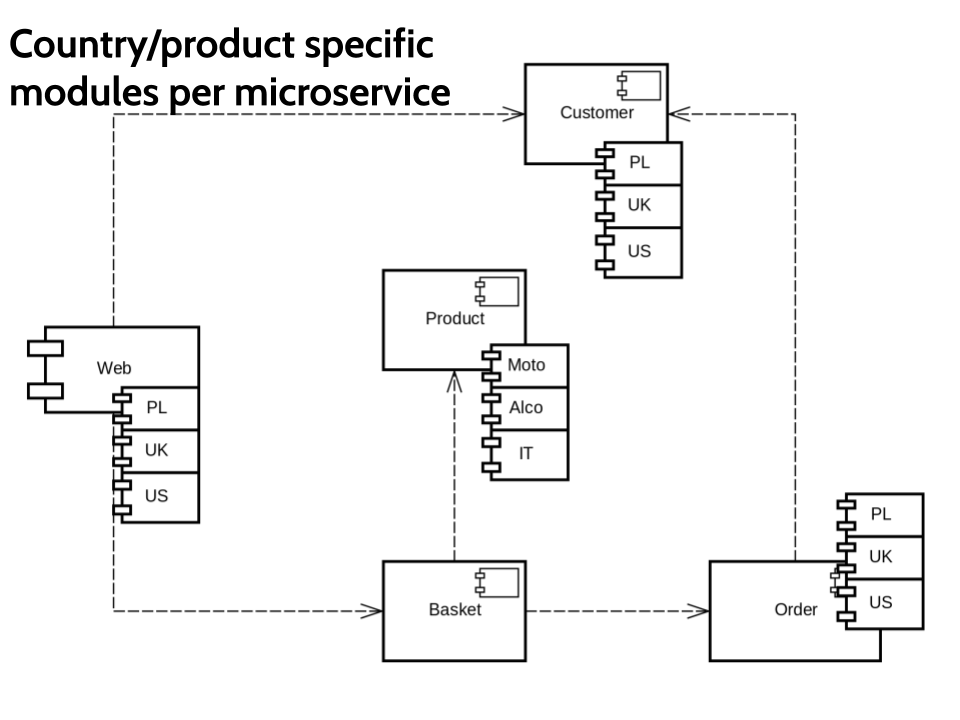
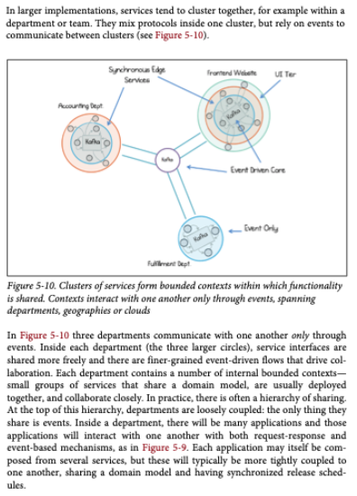

class: center, middle

# System of systems

---

## What drivers architecture

--

1. Functional requirements
2. Quality Attributes (non-functional requirements)
3. Constraints 
4. Principles (consistency & clarity)

---

## Quality Attributes 

--

- Maintainability
- Extensibility
- Performance (response time, latency, etc.)
- Scalability
- Availability
- Security
- Flexibility

--

- Disaster Recovery
- Accessibility
- Monitoring
- Management
- Audit
- Legal, Regulatory and Compliance
- Internationalisation & Localisation

---

## How to check quality attributes?

Capture

Refine

Challenge

---

## Constraints 

--

- People (current and future)! 

--

- Time and budget

--

- Technology (interoperability, platform, maturity, legal)

--

- Organisational

---

## Trade-offs

> If you don’t understand the trade-offs that you’re making by choosing technology X over Y, you shouldn’t be making those decisions.

--

Every architecture made sense at some point in the past, with given constraints and assumptions.

--

Constraints and assumptions do change in time.

--

When you don't know the constraints and assumptions of the day, every architecture looks stupid after some time.

--

How to deal with that?

--

Decision log - list all important decisions and describe all REASONS for a decision (preferably with alternatives considered)

---

## What we need to start?

A new system is needed. What needs to happen before we start drawing diagrams?

--

Requirements

This is how we validate the model

How do you store requirements?

--

Behavioural Specifications

You can find them in [requirements.md](/requirements.md)

---

## Big Ball of Mud

Everything is interconnected

No clear boundaries between modules

Horizontal layers

Hard to maintain

--

How did that happen?

--

Architecture in code is bio-degradable in time if not refactored.

How do we deal with it?

--

- Educate team members
- Share decisions, reasoning and discussions (RFC)
- Write assumptions, decisions and contracts down (test contracts)
- Make refactoring a second nature

> Software architecture is a platform for conversation

---

## Modular monolith

--

### What's a module?

--

A module encapsulates its data (access only via API)

A module has clerly defined collaborators and APIs

Has (almost) all layers (vertical slicing)

Very much like a microservice candidate

Most likely a Bounded Context (words have their own definitions/classes)

---

## Modular monolith

Example

Spring Boot application with the Bounded Contexts (modules) implemented in packages (vertical slices) and the interaction between modules based on invocations of methods on Spring beans residing in a different BC. Domain classes not visible outside of a module (API uses DTOs).

--

What problems does it solve?

--

- Easy to reason about, easier to maintain

--

- Easiest to develop (very basic java app)

--

- Easy to reafactor

--

- Strong consistency (transactions) between modules

--

- Easy to monitor & test (single JVM * number of nodes)

---

## Modular monolith

What problems does it bring?

--

- Cannot scale modules separately

--

- Cannot deploy modules separately (big risk deployments)

--

- Limited set of technologies

--

- What happens when you grow to 10 developers?

--

- What happens when you grow to 200 developers?

--

- What happens when you grow to 1k developers?

---

## Modular Monolith Task

Design your system in C4 model and verify using Sequence Diagrams assuming

- the whole app is a single self-executable jar on Spring Boot
- the number of developers is up to 10

Remember that with modules
- each module has its own database
- no queries between modules possible (only communication via API)

Questions
- Where do you expect errors/exceptions
- How do you handle errors?

---

## Distributed synchronous system

System build of microservices (usually one module per service), with interaction pattern of synchronous, non-idempotent operations. Services invoking each other via HTTP calls. Each microservice can be deployed independently.

What problems does it solve?

--

- Even easier to reason about, easier to maintain

--

- Works with 200 and 1k developers

--

- Small deployment risk

--

- Can scale only modules that need more scalling

--

- Can mix a lot of technologies

---

## Distributed synchronous system

What problems does it bring?

--

- difficult to create (a distributed system)

--

- eventual consistency at most

--

- requires devops (each team responsible for their work on production)

--

- requires teams for tooling

--

- communication inefficiency (HTTP overhead, latency) 

--

- communication complexity (can fail in many places: needs retries, fallbacks, circuit breaker)

--

- not reactive, sub optimual CPU usage

--

- hard to monitor

--

- impossible to test via integration tests (why?)

---

## What we need to consider

How to coordinate between services (Orchestration vs Choreography)?

How to handle failures on each call?

How to handle lack of consistency/transactions between services?

Will the flow be fast enough (each HTTP call costs a lot)?

---

## Orchestration vs Choreography

--

Orchestration - a centralized approach for service composition. The logic is in one place.

--

Choreography - the decision logic is distributed, with no centralized point. Each service knows how to react to different messages.

--

### Task

You have a distributed system (eCommerce) that has to go from single product for single country, into 5 slightly different products for 20 slightly different countries 
(5x20 matrix)

How do you do it?

---

### Original Design

---

### Orchestration

---

### Choreography

---

## The problem with Orchestration

Centralized logic means there is a bottleneck. This team will be required for every change.

--

Where does it make sense?

--

UI composition - sometimes it's easier to have one UX team responsible for customer's experience

--

But remember that Micro-frontends will evolve much faster!

--

When differences are big enough (changes going separate ways) to have dedicated teams, just deploy new cluster for each country/product.

---

## How to handle consistency without transactions

Sending to two different services.

[Jimmy Bogard's blog](https://jimmybogard.com/refactoring-towards-resilience-a-primer/)

---

## Eventual consistency

> To scale infinitely we must avoid coordination

Life beyond distributed transactions: an Apostate's Opinion - Path Helland (Amazon)

--

> In scalable systems, you can’t assume transactions for updates across these different entitsies. Each entity has a unique key and each entity is easily placed into one scope of serializability. How can you know that two separate entities are guaranteed to be within the same scope of serializability (and, hence, atomically updateable)? You only know when there is a single unique key that unifies both. Now it is really one entity!

> If we use hashing for partitioning by entity-key, there’s no telling when two entities with different keys land on the same box.
> If we use key-range partitioning for the entity-keys, most of the time the adjacent keyvalues resides on the same machine but once in a while you will get unlucky and your neighbor will be on another machine.

---

> A scale-agnostic programming abstraction must have the notion of entity as the boundary of atomicity

> If you can’t update the data across two entities in the same transaction, you need a mechanism to update the data in different transactions. The connection between the entities is via a message.

--

> In a system which cannot count on distributed
transactions, the management of uncertainty must be
implemented in the business logic. The uncertainty of the
outcome is held in the business semantics rather than in
the record lock. This is simply workflow. Nothing
magic, just that we can’t use distributed transaction so we
need to use workflow.

--

> Think about the style of interactions common across
businesses. Contracts between businesses include time
commitments, cancellation clauses, reserved resources,
and much more. The semantics of uncertainty is wrapped
up in the behaviour of the business functionality. While
more complicated to implement than simply using
distributed transactions, it is how the real world works…

---

## How to handle consistency without transactions

Imagine user edits an article.

You need to send the article to reader-service (so that it is visible on net) and to search-service (so that it can be full text searched)

None of those communication have a transaction

---

### Option 1: Sending state as domain state

--

1. save article to local DB with state "sending to reader"
1. send to reader
1. save article to local DB with state "sending to search"
1. send to search
1. save article to local DB with state "published successfully"

--

On another thread (@Schedulled):

Check if you have any articles in state "sending ..." for longer than timeout; for each retry/undo

--

Cool feature: 

It works even when your DB does not support transactions (but is atomic)

--

Gets complex the more services you talk with

--

Not cool with parallel work

--

Warning - if you fail to save in last step, you won't know you've published the event.

---

### Option 2: additional collection for sending

1. start transaction
1. save article to local DB to Articles collection
1. save article to SendToReader collection
1. save article to SendToSearch collection
1. commit transaction

--

On another thread (@Schedulled):

1. for both SendToReader and SendToSearch collections
1. Check if you have any articles to be sent
1. send each
1. delete from collection. 

--

On another thread (@Schedulled):

Check if you have any articles to be sent for longer than timeout; for each undo

--

Requires no state changes.

--

Works only with transactional DBs

---

## Google Cloud Spanner

> It’s a highly available and distributed SQL database. In order to guarantee consistency between nodes, they must have clocks synchronized perfectly. In practice, it’s impossible. So, Google uses their proprietary TrueTime technology. It guarantees that the clock difference is below 7 milliseconds within the cluster. How does it help? Well, any node can technically be at most 7 milliseconds ahead of the others. So to guarantee that causality is not violated, each transaction… wait for it… waits. Waits for 7 milliseconds. This clever trick allows Spanner to achieve external consistency. In short, it behaves as if all transactions run sequentially on a single node. In reality, Spanner runs across multiple data centers.

> [Around IT In 256 Seconds By Tomasz Nurkiewicz](https://256.nurkiewicz.com/29)

---

## Will the flow be fast enough

What if each call takes around 50ms?

--

How many calls can you have before it's too slow?

--

Can we have a local cache to save time?

--

When/how do we invalidate this cache?

--

What if we miss the cache?

--

What if it is too big?

--

Complexity rises

---

## Distributed synchronous system Task

Design your system in C4 model and verify using Sequence Diagrams assuming

- the whole system is composed of self-executable jars (microservices) on Spring Boot
- the only channel of communication between services is via synchronous REST calls

Double check:
- How do you handle failures (on each call)?
- How do you handle (in)consistency?
- Can you make the flow faster using a cache?

---

## Distributed asynchronous system

System build of microservices (usually one module per service), with interaction pattern of asynchronous, idempotent operations. Services communicating with each other by publishing events on a shared event bus (Kafka). Each microservice can be deployed independently.

What problems does it solve?

--

- Easiest to reason about, easiest to maintain, because of full independence of each microservice

--

- No coupling. Microservices are not aware of other microservices, and will continue their work when available (after restart, redeployment, after outage, work dose not fail)

--

- Best resource usage (no blocking)

--

- Works with 200 and 1k developers

--

- Small deployment risk

--

- Can scale only modules that need more scalling

--

- Can mix a lot of technologies

---

## What problems does it bring?

--

- difficult to create (a distributed system)

--

- eventual consistency at most

--

- event migration on schema change is much harder / takes longer

--

- can create cycles (you need to control globale event chains)

--

- can create communication chaos (public events vs local events)

---

## What problems does it bring?

- requires devops (each team responsible for their work on production)

--

- requires teams for tooling

--

- event bus is a single point of failure (requires a good operations team)

--

- hard to monitor

--

- impossible to test via integration tests

--

- requires indempotency (exactly once semantics is possible, depending on your tool, but more complex)

---

## Issues of async approach

What if you need to join data from many events (building read models)

Your process can freeze at some service and never move forward - your user will never know (async error handling)

Nobody knows what is the state of a process (saga pattern)

---

## Stateful vs Stateless services

With synchronous or mixed communication some services can be stateless. You react to an event or call, you get the data you need from other services.

--

Stateless services are faster to start, easier to restart, easier to maintain.

--

In completely asynchronous communication, services that need more data than the event has, need to be stateful (build read models). 

--

Imagine you need to process reversal in a bank. You listen to Reversal event. To validate if it is possible, you need to listen to all transactions to find the one for reversal. 

--

How long will you store those transactions (size problem)? Where will you store them? How will you mark already reversed transactions (indempotency)? What exactly do you need to do?

--

How much work is that?

---

## Read Model

A read model is like a cache, but filled from a queue. 

--

Because you read from a queue, you do not lose data when you are offline.

--

Thus you can assume your read model is either up to date, or soon will be.

--

Like in a cache, you cannot change anything. 

--

If you want to implement it yourself, it's a lot of (simple) code.

--

You can implement this yourself, or you can use database outside-in approach with stream processing and local state.

Simplified in Kafka. Windowing + data get to either in-memory hashmap or local RocksDB. Updated on the fly.

---

## How to handle long processes?

*Saga (anti)pattern*

One of the options is to create a special module/microservice to handle the state of the process.

If the process takes too long, or fails/hangs at some point, this module will eventually create compensation or roll back all the involved local states (microservices).

--

The problem is: now you write twice as much code to detect, compensate/rollback, as the positive flow.

And you had all of that for free in the monolith!

--

That's why a Saga is often called an anti-pattern (lots of code to handle it). In practice, you need to be flexible, you need to know all your options, and decide based on complexity, probability, cost of failure.

Just be EXPLICIT about it. Write down in docs!

---

## How to handle errors

There are 3 types of errors

- error a programmer can fix
- error a user can fix
- error nobody can do anything about

These are usually not recognized, and you have a lot of "ignored"
errors/warns on production.

--

How you should do it?

---

### Error a programmer can fix

This is an error, which can/should be fixed by our code on production. There are 2 subclasses

- error() you need to wake up at 3am to write the fix
- warn() it can wait for 9am when you are back at work for the fix

--

NEVER log error() for something you cannot do anything about!

---

### Error a user can fix

If the error can be fixed by your user (invalid data, etc.), you need to build a dashboard. A single microservice that gathers all the errors (from a topic or rest calls), presents them to the user on their first page after login.

--

Important: ALWAYS show an action button to take the user where she needs to go to fix the problem. ALWAYS explain what needs to be done.

If you cannot write a good call-for-action & give a link, you are only pissing the user off.

---

### Error no one can fix

If you can't do shit about it, and the user cannot either, it's not an error. It's a feature. Measure it for later, but remove it from logs.

---

# Apache Kafka

Your message bus may be an implementation detail

But programming is a sum of implementation details

Your architecture will depend on this a bit

Take a look at an example visualization by softwaremill

https://softwaremill.com/kafka-visualisation/

---

## linear scalability

Transaction log structure

What all DBs do

Data is copied directly from the disk buffer to the network buffer (zero copy)

No indexing

Where's consumer at (consumer_offsets topic)

---

## strong ordering guarantees

> A partition is just a bucket that data is put into, much like buckets used to group data in a hash table. In Kafka’s terminology each log is a replica of a partition held on a different machine. (So one partition might be replicated three times for high availability. 

> Each replica is a separate log with the same data inside it.) What data
goes into each partition is determined by a partitioner, coded into the Kafka producer. The partitioner will either spread data across the available partitions in a round-robin fashion or, if a key is provided with the message, use a hash of the key to determine the partition number. This latter point ensures that messages with the same key are always sent to the same partition and hence are strongly ordered

---

## consumer groups

> Consumers label themselves with a consumer group name, and each record published to a topic is delivered to one consumer instance within each subscribing consumer group.

> This is nothing more than publish-subscribe semantics where the subscriber is a cluster of consumers instead of a single process.

> The way consumption is implemented in Kafka is by dividing up the partitions in the log over the consumer instances so that each instance is the exclusive consumer of a "fair share" of partitions at any point in time. This process of maintaining membership in the group is handled by the Kafka protocol dynamically. If new instances join the group they will take over some partitions from other members of the group; if an instance dies, its partitions will be distributed to the remaining instances.

> Kafka only provides a total order over records within a partition, not between different partitions in a topic. Per-partition ordering combined with the ability to partition data by key is sufficient for most applications. However, if you require a total order over records this can be achieved with a topic that has only one partition, though this will mean only one consumer process per consumer group.

---

## compacted topics

> By default, topics in Kafka are retention-based: messages are retained for some configurable amount of time (2 weeks default)

> compacted topics retain only the most recent events, with any old events, for a certain key, being removed. They also support deletes

---

## Building read models

> Tables are a local manifestation of a complete topic—usually compacted—held in a state store by key. (You might also think of them as a stream with infinite retention.) 

> Global KTables are broadcast: each service instance gets a complete copy of the entire table. 

> Regular KTables are partitioned: the dataset is spread over all service instances.

You can get the data into a HashMap (in memory), RocksDB (local filesystem), or anything else.

> The default implementation used by Kafka Streams DSL is a fault-tolerant state store using 1. an internally created and compacted changelog topic (for fault-tolerance) and 2. one (or multiple) RocksDB instances (for cached key-value lookups).

> As a yardstick, RocksDB (which Kafka Streams uses) will bulk-load ~10M 500 KB objects per minute (roughly GbE speed)

---

## Transactional publishing

> Kafka ships with built-in transactions, in much the same way that most relational databases do.

> They remove duplicates, which cause many streaming operations to get incorrect results (even something as simple as a count).

> They allow groups of messages to be sent, atomically, to different topics

> when we save data to the state store, then send a message to another service, we can wrap the whole thing in a transaction

> The transaction coordinator is the ultimate arbiter that marks a transaction committed atomically, and maintains a transaction log to back this up (this step implements two-phase commit).

For a very good and easy to understand description of guarantees in Kafka see this [article](https://medium.com/@andy.bryant/processing-guarantees-in-kafka-12dd2e30be0e) by Andy Bryant. 

---

## Distributed asynchronous system Task

Design your system in C4 model and verify using Sequence Diagrams assuming

- the whole system is composed of self-executable jars (microservices) on Spring Boot
- the only channel of communication between services is via asynchronous events on Kafka

Additional considerations:
- how will you handle freeze monitoring
- how will you handle errors in long running processes
- how long will your user wait for an error

---

## Real Communication Phenomenon

So which approach is better? Sync, Async, Monolithic?

--

In practice it depends on communication patterns between people.

--

Inside a single team it's easy to coordinate. People work and talk with each other all the time. Between teams it's usually not worth it. You don't want to have more meetings, do you?

--

- Public communication (between teams) should be event based, to decouple services

--

- Inter-team communication (between services of a single team) can be anything you want. You could event synchronously deploy microservices, and you'll be usually still fine

--

- Private communication (between modules of a single service) should depend on how you want to be able to evolve it later

---

Thus we usually end up with a separate public message bus, and separate inter-team message buses.

