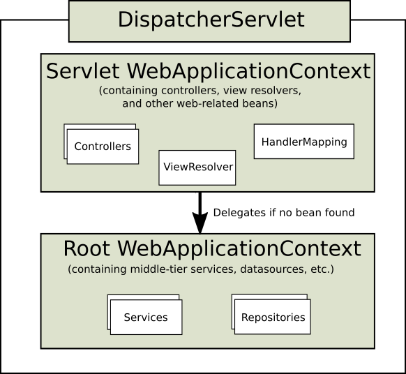

class: center, middle

# MVC

by Jakub Nabrdalik

---

## Embedded server

Use prepared module:
- spring-boot-starter-tomcat Imports Spring Boot’s default HTTP engine
- spring-boot-starter-jetty Imports the Jetty HTTP engine
- spring-boot-starter-undertow Imports the Undertow HTTP engine

Or just add it manually to the classpath (Boot checks the classpath for it).

---

## Embedded server: customization

```
application.properties
server.port — The listen port for incoming HTTP requests.
server.address — The interface address to bind to.
server.sessionTimeout — A session timeout.
//and more
```

Or

```java
@Component
public class CustomizationBean 
	implements EmbeddedServletContainerCustomizer {

	@Override
	public void customize(ConfigurableEmbeddedServletContainer container) {
		container.setPort(9000);
	}
}
```

---

## Embedded server: customization

If you need more options:

```Java
@Bean
public ConfigurableServletWebServerFactory servletContainer() {
	TomcatEmbeddedServletContainerFactory factory = 
		new TomcatEmbeddedServletContainerFactory();
	factory.setPort(9000);
	factory.setSessionTimeout(10, TimeUnit.MINUTES);
	factory.addErrorPages(new ErrorPage(HttpStatus.404, "/notfound.html");
	return factory;
}
```

Out of the box:

TomcatEmbeddedServletContainerFactory

JettyEmbeddedServletContainerFactory

UndertowEmbeddedServletContainerFactory

---

## DispatcherServlet/FrontController


---

## Setting up in web.xml

```xml
<servlet>
	<servlet-name>testkata</servlet-name>
	<servlet-class>org.springframework.web.servlet.DispatcherServlet</servlet-class>
	<init-param>
		<param-name>contextConfigLocation</param-name>
		<param-value>classpath:spring/webmvc.ioc.xml</param-value>
	</init-param>
	<load-on-startup>1</load-on-startup>
</servlet>
<servlet-mapping>
	<servlet-name>testkata</servlet-name>
	<url-pattern>/*</url-pattern>
</servlet-mapping>
```

---

## Setting up without web.xml

```java
public class MyWebAppInitializer extends AbstractAnnotationConfigDispatcherServletInitializer {

    @Override
    protected Class<?>[] getRootConfigClasses() {
        return new Class<?>[] { RootConfig.class };
    }

    @Override
    protected Class<?>[] getServletConfigClasses() {
        return new Class<?>[] { App1Config.class };
    }

    @Override
    protected String[] getServletMappings() {
        return new String[] { "/app1/*" };
    }
}
```

---

### Context over context



---

## Controllers

```java
@Controller
class ProductController {
	private ProductService productService;

	ProductController(ProductService productService) {
		this.productService = productService;
	}

	@RequestMapping(value = "/", method = RequestMethod.GET)
	String index() {
		productService.doSomething(...)
		return "redirect:/index";
	}
}
```

---

## Controller method examples

```java
@RequestMapping(value = "/index", method = RequestMethod.GET)
Map list() {
	List<Product> products = productRepository.findAll();
	return ImmutableMap.of("products", products);
}

@RequestMapping(value = "/some/mine", produces="application/json")
Map mine() {
	List<SomeEntity> entities = someEntityRepository.findByUsername("some");
	return ["entities": entities]
}

@GetMapping("/accounts/{id}/alerts")
Flux<Alert> getAccountAlerts(@PathVariable Long id) {
	return productService
		.getAccount(id)
		.flatMap(account ->
			this.webClient
				.perform(get("/alerts/{key}", account.getKey()))
				.extract(bodyStream(Alert.class)));
}
```

---

## @RequestMapping

With path params

```java
@GetMapping(value="/owners/{ownerId}")
String findOwner(@PathVariable String ownerId, Model model) {
	Owner owner = ownerService.findOwner(ownerId);
	model.addAttribute("owner", owner);
	return "displayOwner";
}
```

---

## @RequestMapping

With regex, or ant

```java
@RequestMapping("/spring-web/{symbolicName:[a-z-]}-{version:\\d\\.\\d\\.\\d}{extension:\\.[a-z]}")
void handle(@PathVariable String version, @PathVariable String extension) {
	// please, kill me
}
```

Or

```
/owners/*/pets/{petId}
/myPath/*.do
```

---

## What if URL matches multiple patterns?

Let’s find out the most specific match

- Lower count of URI variables and * = more specific
- Longer is more specific
- Fewer wildcards is more specific
- default (/**) is less specific than anything else
- prefil pattern (/public/**) is less specific than any other

You keep it complicated = you will have bad time debugging

---

## Matrix patterns

```java
// GET /owners/42;q=11/pets/21;q=22
@GetMapping(value = "/owners/{ownerId}/pets/{petId}")
void findPet(
	@MatrixVariable(value="q", pathVar="ownerId") int q1,
	@MatrixVariable(value="q", pathVar="petId") int q2) {
	// q1 == 11
	// q2 == 22
}
```

You have to set it up explicite, though. Won’t work out of the box.

---

## Only if a param or header exist

```java
@GetMapping(
		value = "/pets/{petId}", 
		params="myParam=myValue")
void findPet(
		@PathVariable String ownerId, 
		@PathVariable String petId, 
		Model model) {
	// implementation omitted
}

@GetMapping(value = "/pets", headers="myHeader=myValue")
void findPet(
		@PathVariable String ownerId, 
		@PathVariable String petId, 
		Model model) {
	// implementation omitted
}
```

Works with: "myParam", "!myParam", or "myParam=myValue"

---

## @RequestMapping on class

```java
@Controller
@RequestMapping("/appointments")
public class AppointmentsController {
	...

	@GetMapping
	Appointment get() {
		return appointmentBook.getAppointmentsForToday();
	}

	@GetMapping(value="/{day}")
	Appointment getForDay(
			@PathVariable @DateTimeFormat(iso=ISO.DATE) Date day,
			Model model) {
		return appointmentBook.getAppointmentsForDay(day);
	}
}
```

---

## Combine on class with params

```java
@Controller
@RequestMapping("/owners/{ownerId}")
class RelativePathUriTemplateController {

	@GetMapping("/pets/{petId}")
	void findPet(
			@PathVariable String ownerId,
			@PathVariable String petId, 
			Model model) {
		// implementation omitted
	}
}
```

---

## Consuming and producing

```java
@Controller
@PostMapping(value = "/pets", consumes="application/json")
public void addPet(@RequestBody Pet pet) { ... }
```

if the Content-Type request header matches the specified media type

```java
@Controller
@GetMapping(value = "/pets/{petId}", produces="application/json")
@ResponseBody
Pet getPet(@PathVariable String petId) { ... }
```

if the Accept request header matches the specified media type
ensures the actual content type used to generate the response respects the
media types specified in the produces

---

## Arguments for controller methods

- @PathVariable
- @RequestParam
- @RequestHeader
- @RequestBody //the whole body
- @RequestPart //for multipart/form-data
- Map, Model, ModelMap
- RedirectAttributes
- Command or form objects
- Errors, BindingResult
- ServletRequest, HttpServletRequest, WebRequest
- HttpSession
- Locale
- InputStream, Reader, OutputStream, Writer
- Principal
- RequestEntity
- and more...

https://docs.spring.io/spring/docs/current/spring-framework-reference/web.html#mvc-ann-arguments

---

## Raw request

```java
@RequestMapping("/handle")
void handle(RequestEntity<String> request) {
	HttpMethod method = request.getMethod();
	URI url = request.getUrl();
	String body = request.getBody();
}
```

Since Spring 4.1

---

## Returned types

- ModelAndView, Model, Map
- @ModelAttribute annotated reference data accessor methods.
- View
- String view name or redirect
- void
- @ResponseBody (converted via HttpMessageConverter)
- any type of your own (assumes it’s the only thing in the model)
- HttpEntity<T> and ResponseEntity<T>
- Observable
- Flux / Mono
- and more...

https://docs.spring.io/spring/docs/current/spring-framework-reference/web.html#mvc-ann-return-types

---

## Return examples

```java
@GetMapping(value = "/")
String index() {
	return "redirect:/index";
}

@GetMapping(value = "/index")
Map list() {
	List<Product> products = productRepository.findAll();
	return ImmutableMap.of("products", products);
}

@GetMapping(value = "/loans/mine", produces="application/json")
List<Loan> myLoans() {
	String username = loggedUserRepository.getLoggedUserName();
	return loanRepository.findByUsername(username);
}

@GetMapping(value = "/loans/mine", produces="application/json")
ResponseEntity<List<Loan>> loans() {
	return ResponseEntity.
		created(location).
		header("MyResponseHeader", "MyValue").
		body(loans);
}

ResponseEntity(
	T body, MultiValueMap<String, String> headers, HttpStatus statusCode)
```


---

## Helper methods

Annotation that identifies methods which initialize the WebDataBinder which will be used for populating command and form object arguments of annotated
handler methods.

```java
@InitBinder
void initBinder(WebDataBinder binder) {
	SimpleDateFormat dateFormat = new SimpleDateFormat("yyyy-MM-dd");
	dateFormat.setLenient(false);
	binder.registerCustomEditor(Date.class,
	new CustomDateEditor(dateFormat, false));
}

//signature
registerCustomEditor(Class<?> requiredType, PropertyEditor propertyEditor);
```

---

## Helper methods

@ModelAttribute methods are used to populate the model with commonly
needed attributes for example to fill a drop-down with states or with pet types, or to retrieve a command object like Account in order to use it to represent the data on an HTML form.

```java
@ModelAttribute
Account addAccount(@RequestParam String number) {
	return accountManager.findAccount(number);
}
```

---

## @ModelAttribute and data binding

```java
@PostMapping(value="/owners/{ownerId}/pets/{petId}/edit")
public String processSubmit(@ModelAttribute Pet pet) { }
```

A @ModelAttribute on a method argument indicates the argument should be retrieved from the model. If not present in the model, the argument should be instantiated first and then added to the model

Once present in the model, the argument’s fields should be populated from all request parameters that have matching names.

---

## @ModelAttribute and data binding

```java
@PostMapping(value="/owners/{ownerId}/pets/{petId}/edit")
String processSubmit(@ModelAttribute Pet pet) { }
```

Where does a pet come from?

--

- already in the model due to use of @SessionAttributes
- already in the model due to an @ModelAttribute method in the same controller
- retrieved based on a URI template variable and type converter
- instantiated using its default constructor

And then it is populated from request (a.k.a. data binding)

---

## Building URIs

```java
UriComponents uriComponents =
	UriComponentsBuilder
		.fromUriString(
			"http://example.com/hotels/{hotel}/bookings/{booking}")
		.build();

URI uri = uriComponents.expand("42", "21").encode().toUri();
```

Typical usage involves:

--

Create a UriComponentsBuilder with one of the static factory methods
(such as fromPath(String) or fromUri(URI))

--

Set the various URI components through the respective methods
(scheme(String), userInfo(String), host(String), port(int), path(String),
pathSegment(String...), queryParam(String, Object...), and
fragment(String).

--

Build the UriComponents instance with the build() method.

---

## Building URIs

ServletUriComponentsBuilder - reusing servlet information

```java
// Re-use host, scheme, port, path and query string
// Replace the "accountId" query param
ServletUriComponentsBuilder ucb = ServletUriComponentsBuilder
		.fromRequest(request)
		.replaceQueryParam("accountId", "{id}").build()
		.expand("123")
		.encode();

// Re-use host, port and context path
// Append "/accounts" to the path
ServletUriComponentsBuilder ucb = ServletUriComponentsBuilder
	.fromContextPath(request)
	.path("/accounts")
	.build()
```

---

## Building URIs

MvcUriComponentsBuilder - helps to build URIs to Spring MVC controllers and methods from their request mappings.

```java
@Controller
@RequestMapping("/hotels/{hotel}")
class BookingController {

@RequestMapping("/bookings/{booking}")
String getBooking(@PathVariable Long booking) {
	…
	UriComponents uriComponents = MvcUriComponentsBuilder
		.fromMethodCall(
			on(BookingController.class).getBooking(21)
		)
		.buildAndExpand(42);

	URI uri = uriComponents.encode().toUri();
	...
```

hotel = 42, booking = 21

---

## RESTafaranism

@RestController = @ResponseBody + @Controller

---

## Controller Advices

Classes annotated with @ControllerAdvice can contain:

- @ExceptionHandler
- @InitBinder
- @ModelAttribute

annotated methods, and these methods will apply to @RequestMapping
methods across all controller hierarchies as opposed to the controller
hierarchy within which they are declared.


```java
// Target all Controllers annotated with @RestController
@ControllerAdvice(annotations = RestController.class)
class AnnotationAdvice {}

// Target all Controllers within specific packages
@ControllerAdvice("org.example.controllers")
class BasePackageAdvice {}

// Target all Controllers assignable to specific classes
@ControllerAdvice(
	assignableTypes = {ControllerInterface.class, AbstractController.class})
class AssignableTypesAdvice {}
```

---

## MVC customization

To customize a lot of MVC defaults, create a @Configuration class which implements WebMvcConfigurer interface.

```Java
@Configuration
public class WebConfig implements WebMvcConfigurer {

    // Implement configuration methods...
}
```

For example, to clear MDC at an end of a request

```Java
@Configuration
class WebConfig implements WebMvcConfigurer {
   @Override
    public void addInterceptors(InterceptorRegistry registry) {
        registry.addInterceptor(
        	new HandlerInterceptor() {
                @Override
                public void postHandle(
                        HttpServletRequest request,
                        HttpServletResponse response,
                        Object handler,
                        ModelAndView modelAndView) {
                    MDC.clear();
                }
            }
        );
    }
}
```

---

## Views

methods in the Spring Web MVC controllers must resolve to a logical view
name, either explicitly (e.g., by returning a String, View, or ModelAndView) or
implicitly (i.e., based on conventions)

---

## ViewResolver

- AbstractCachingViewResolver
- XmlViewResolver
- ResourceBundleViewResolver
- UrlBasedViewResolver
- InternalResourceViewResolver
- VelocityViewResolver
- FreeMarkerViewResolver
- ContentNegotiatingViewResolver

---

## UrlBasedViewResolver

> Simple implementation of the ViewResolver interface that effects the direct resolution of logical view names to URLs, without an explicit mapping definition. This is appropriate if your logical names match the names of your view resources in a straightforward manner, without the need for arbitrary mappings.

---

## ContentNegotiatingViewResolver

> Implementation of the ViewResolver interface that resolves a view based on the request file name or Accept header (media type).

> Once the requested media type has been determined, this resolver queries
each delegate view resolver for a View and determines if the requested media
type is MediaType compatible with the view's View content type. The most
compatible view is returned.

---

## ContentNegotiatingViewResolver

```Java
@Configuration
class WebConfig implements WebMvcConfigurer {
	@Override
	public void configureViewResolvers(ViewResolverRegistry registry) {
		registry.enableContentNegotiation(true, new MappingJackson2JsonView())
		registry.viewResolver(createThymeleafViewResolver())
	}

	@Override
	public void configureContentNegotiation(ContentNegotiationConfigurer configurer) {
		configurer
			.mediaTypes(['json': MediaType.APPLICATION_JSON, 'html':MediaType.TEXT_HTML])
			.defaultContentType(MediaType.TEXT_HTML)
	}
}
```

---

## Redirecting

```java
@GetMapping(value = "/")
String index() {
	return "redirect:/index";
}
```

---

## Using model in view: example

```xml
<!DOCTYPE html SYSTEM
"http://www.thymeleaf.org/dtd/xhtml1-strict-thymeleaf-spring3-3.dtd">
<html xmlns:th="http://www.thymeleaf.org" lang="en">
[...]
<div class="container">
	<h1>Products</h1>
	<div th:each="product : ${products}">
		<h4>Name: <b th:text="${product.name}" /></h4>
		<p>Description: <span th:text="${product.description}" /> </p>
		<p>SKUs:
		<div th:each="sku : ${products.skus}">
			<b th:text="${sku.name}" />
		</div>
	</p>
	</div>
</div>
```

---

## ModelAndView

```java
public ModelAndView handleRequest() {
	ModelAndView mav = new ModelAndView("displayShoppingCart");
	mav.addObject(cartItems);
	mav.addObject(user);
	return mav;
}
```

---

## Serving static resources

```java
@Configuration
public class WebConfig implements WebMvcConfigurer {
	@Override
	public void addResourceHandlers(ResourceHandlerRegistry registry) {
		registry
			.addResourceHandler("/resources/**")
			.addResourceLocations("/public-resources/");
	}
}
```

---

## Serving view without controller

```Java
@Configuration
class WebConfig implements WebMvcConfigurer {
	@Override
	void addViewControllers(ViewControllerRegistry registry) {
		registry.addViewController('/error').setViewName('error')
	}
}
```

---

## Locales

RequestContext //the class you add to controller method params

```java
requestContext.getLocale()
requestContext.getTimeZone() //may or may not return something
```

- AcceptHeaderLocaleResolver
- CookieLocaleResolver
- SessionLocaleResolver

LocaleChangeInterceptor will change locale if siteLanguage is found, i.e.:
http://www.sf.net/home.view?siteLanguage=pl

---

## Handling exceptions


Implement HandlerExceptionResolver
resolveException(Exception, Handler)

Use SimpleMappingExceptionResolver
(map class to view name)

Create @ExceptionHandler method
on @Controller or @ControllerAdvice

---

## DefaultHandlerExceptionResolver

Translates Spring MVC exceptions to specific error status codes:

- BindException - 400 (Bad Request)
- ConversionNotSupportedException - 500 (Internal Server Error)
- HttpMediaTypeNotAcceptableException - 406 (Not Acceptable)
- HttpMediaTypeNotSupportedException - 415 (Unsupported Media Type)
- HttpMessageNotReadableException - 400 (Bad Request)
- HttpMessageNotWritableException - 500 (Internal Server Error)
- HttpRequestMethodNotSupportedException - 405 (Method Not Allowed)
- MethodArgumentNotValidException - 400 (Bad Request)
- MissingServletRequestParameterException - 400 (Bad Request)
- MissingServletRequestPartException - 400 (Bad Request)
- NoHandlerFoundException - 404 (Not Found)
- NoSuchRequestHandlingMethodException - 404 (Not Found)
- TypeMismatchException - 400 (Bad Request)

---

## Handling exceptions

In one @Controller

```java
@ExceptionHandler(IOException.class)
ResponseEntity<String> handleIOException(IOException ex) {
	// prepare responseEntity
	return responseEntity;
}
```

Or globally in a @ControllerAdvice

Extending ResponseEntityExceptionHandler is a convenient way.

---

## Handling exceptions

You can also annotate the Exception, but you will bind it with the view.

```java
@ResponseStatus(HttpStatus.FORBIDDEN)
class AccessRefusedException extends RuntimeException {
	...
}
```

Marks a method or exception class with the status code and reason that
should be returned. 

The status code is applied to the HTTP response when the
handler method is invoked, or whenever said exception is thrown.

---

## What WebApplicationContext provides

```java
@RunWith(SpringRunner.class)
@WebAppConfiguration
@ContextConfiguration
public class WacTests {
	@Autowired WebApplicationContext wac; // cached
	@Autowired MockServletContext servletContext; // cached
	@Autowired MockHttpSession session;
	@Autowired MockHttpServletRequest request;
	@Autowired MockHttpServletResponse response;
	@Autowired ServletWebRequest webRequest;
}
```

---

## Session/Request scoped in tests

```java
@RunWith(SpringJUnit4ClassRunner.class)
@ContextConfiguration
@WebAppConfiguration
public class RequestScopedBeanTests {
	@Autowired UserService userService;
	@Autowired MockHttpServletRequest request;

	@Test
	public void requestScope() {
		//given
		request.setParameter("user", "enigma");
		request.setParameter("pswd", "$pr!ng");
		//when
		LoginResults results = userService.loginUser();
		...
	}
}
```

---

## Spring MVC testing: IntegrationSpec

```java
@ActiveProfiles([Profiles.INTEGRATION])
@AutoConfigureWireMock(port = 0)
@AutoConfigureMockMvc
@Transactional
@SpringBootTest(
    classes = [AppRunner],
    webEnvironment = SpringBootTest.WebEnvironment.RANDOM_PORT)
abstract class IntegrationSpec extends Specification {
    
    @Autowired MockMvc mockMvc

	@Value('${wiremock.server.port}') String wiremockServerPort

    @Autowired WireMockServer wireMockServer

    @LocalServerPort int port //same as @Value('${local.server.port}') 
    
    @Before
    void resetWireMockStubs() {
        WireMock.reset()
    }
}
```

---

## Final MVC test

```java
import static org.springframework.http.MediaType.APPLICATION_JSON

class AcceptanceSpec extends IntegrationSpec {
    @Autowired
    FilmFacade filmFacade

    def "positive renting scenario"() {
        given: 
            filmFacade.add(trumper)
            filmFacade.add(clingon)

        when: 
            ResultActions getFilms = mockMvc.perform(get("/films"))
        
        then: 
            getFilms
            	.andExpect(status().isOk())
                .andExpect(content().json("""
                {
                    "content": [
                        {"title":"$clingon.title","type":"$clingon.type"},
                        {"title":"$trumper.title","type":"$trumper.type"}
                    ]
                }"""))	
```

---

## Spring MVC testing: more options

```java
@Test
void "should return successful json to customer on payment success"() {
	//expect
	mockMvc.perform(post('/pay').
		param('billedCode', BillerFactory.CODE).
		param('msisdn', ExternalBillerServiceMock.CORRECT_MSISDN).
		param('productCode', BillerFactory.PRODUCT_CODE).
		accept(MediaType.parseMediaType(JSON_MEDIA_TYPE))).
		andExpect(status().isOk()).
		andExpect(content().contentType(JSON_MEDIA_TYPE)).
		andExpect(content().string('{"status":"ok"}'))
}
```

---

## File uploads

```java
mockMvc
	.perform(fileUpload("/doc")
	.file("a1", "ABC".getBytes("UTF-8")));
```

---

## Test slices 

> slice restricts component scan to appropriate components and loads a very restricted set of auto-configuration classes. 

--

Usually used with @MockBean or registering stubs/mocks in Spring Context

```Java
@JsonTest //ObjectMapper etc

@WebMvcTest 
//@Controller, @ControllerAdvice, @JsonComponent, Converter, GenericConverter, 
//Filter, HandlerInterceptor, WebMvcConfigurer, HandlerMethodArgumentResolver. 
//No standard beans

@WebFluxTest //same, but for WebFlux

@DataJpaTest @JdbcTest @DataJdbcTest @JooqTest @DataMongoTest etc.
```

https://docs.spring.io/spring-boot/docs/current/reference/html/appendix-test-auto-configuration.html#test-auto-configuration

---

## Test slices example

```Java
@WebMvcTest(UserVehicleController.class)
class MyHtmlUnitTests {

    @Autowired
    private WebClient webClient;

    @MockBean
    private UserVehicleService userVehicleService;

    @Test
    void testExample() throws Exception {
        given(this.userVehicleService.getVehicleDetails("sboot"))
                .willReturn(new VehicleDetails("Honda", "Civic"));
        HtmlPage page = this.webClient.getPage("/sboot/vehicle.html");
        assertThat(page.getBody().getTextContent()).isEqualTo("Honda Civic");
    }
}
```

---

## Manual Transactions - since 4.1

(more on that later)

```java
@ContextConfiguration(classes = TestConfig.class)
public class ProgTransactionMngTests 
	extends AbstractTransactionalJUnit4SpringContextTests {

	@Test
	public void transactionalTest() {
		// assert initial state in test database:
		assertNumUsers(2);
		deleteFromTables("user");
		
		// changes to the database will be committed!
		TestTransaction.flagForCommit();
		TestTransaction.end();
		assertFalse(TestTransaction.isActive());
		assertNumUsers(0);
		TestTransaction.start();
		
		// perform other actions against the database 
		//that will be rolled back after the test completes...
}
```

---

## Around transactions...

but it’s usualy a very bad idea

```java
@BeforeTransaction
public void verifyInitialDatabaseState() {
	// logic to verify the initial state before a transaction is started
}

@Before
public void setUpTestDataWithinTransaction() {
	// set up test data within the transaction
}

@After
public void tearDownWithinTransaction() {
	// execute "tear down" logic within the transaction
}

@AfterTransaction
public void verifyFinalDatabaseState() {
	// logic to verify the final state after transaction has rolled back
}
```

---

## Populating the database

```java
@Test
public void databaseTest {
	ResourceDatabasePopulator populator = new ResourceDatabasePopulator();
	populator.addScripts(
		new ClassPathResource("test-schema.sql"),
		new ClassPathResource("test-data.sql"));
	populator.setSeparator("@@");
	populator.execute(this.dataSource);
	// execute code that uses the test schema and data
}
```

If you really have to… because the speed is going to be painful.

---

## Manual SQL setup

```java
@RunWith(SpringJUnit4ClassRunner.class)
@ContextConfiguration
@Sql("/test-schema.sql")
public class DatabaseTests {
	@Test
	public void emptySchemaTest {
		// execute code that uses the test schema without any test data
	}

	@Test
	@Sql({"/test-schema.sql", "/test-user-data.sql"})
	public void userTest {
		// execute code that uses the test schema and test data
	}
}
```

Please… don’t.

Use liquidbase, flyway or anything like that

---

## Testing with @SpringBootTest

```java
@SpringBootTest(classes = [AppRunner])
abstract class IntegrationSpec extends Specification {...
```

Uses SpringBootContextLoader as the default ContextLoader when no specific @ContextConfiguration(loader=...) is defined.

Automatically searches for a @SpringBootConfiguration when nested @Configuration is not used, and no explicit classes are specified.

Allows custom Environment properties to be defined using the properties attribute.

Provides support for different webEnvironment modes, including the ability to start a fully running container listening on a defined or random port.

Registers a TestRestTemplate bean for use in web tests that are using a fully running container.


---

## Testing: discover the port

```java
@RunWith(SpringRunner.class)
@SpringBootTest(webEnvironment = WebEnvironment.RANDOM_PORT)
public class RandomPortWebTestClientExampleTests {
	@LocalServerPort int port;
}
```

---

## Testing: TestRestTemplate

```java
@RunWith(SpringRunner.class)
@SpringBootTest(webEnvironment = WebEnvironment.RANDOM_PORT)
public class RandomPortTestRestTemplateExampleTests {

	@Autowired
	private TestRestTemplate restTemplate;

	@Test
	public void exampleTest() {
		String body = this.restTemplate.getForObject("/", String.class);
		assertThat(body).isEqualTo("Hello World");
	}
}
```

---

## Testing: WebTestClient

```java
@RunWith(SpringRunner.class)
@SpringBootTest(webEnvironment = WebEnvironment.RANDOM_PORT)
public class RandomPortWebTestClientExampleTests {

	@Autowired
	private WebTestClient webClient;

	@Test
	public void exampleTest() {
		this.webClient.get().uri("/").exchange().expectStatus().isOk()
				.expectBody(String.class).isEqualTo("Hello World");
	}

}
```

---

## Spring Data Web support

Requires SpringMVC turned on.

```java
@Configuration
@EnableWebMvc
@EnableSpringDataWebSupport //Spring HATEOAS stuff registered if on classpath
class WebConfiguration { }
```

---

## Domain class converter

```java
@Controller
@RequestMapping("/users")
class UserController {
	
	@RequestMapping("/{id}")
	public String showUserForm(
			@PathVariable("id") User user, 
			Model model) {
		model.addAttribute("user", user);
		return "userForm";
	}
}
```

The instance can be resolved by letting Spring MVC convert the path variable
into the id type of the domain class first and eventually access the instance
through calling findOne(…) on the repository instance registered for the domain
type.

Be careful like hell, because: SECURITY.

Also you can register our own converters.

---

## HandlerMethodArgumentResolver

```java
@Controller
@RequestMapping("/users")
class UserController {

	@Autowired UserRepository repository;

	@RequestMapping
	String showUsers(Model model, Pageable pageable) {
		model.addAttribute("users", repository.findAll(pageable));
		return "users";
	}
}
```

Request parameters going into Pageable:

- page - number of the page you want to retrieve
- size - size of the page you want to retrieve
- sort - ?sort=firstname&sort=lastname,asc

---

## HandlerMethodArgumentResolver

What if I have several tables?

```java
public String showUsers(Model model,
		@Qualifier("foo") Pageable first,
		@Qualifier("bar") Pageable second) { … }
```

Request parameters going into Pageable:

- foo_page - number of the page you want to retrieve
- bar_page - number of the page you want to retrieve

---

## Also possible:

paged resources - HATEOAS

```json
{ 
	"links" : [ 
		{ 
			"rel" : "next",
			"href" : "http://localhost:8080/persons?page=1&size=20 
		}
	],
	"content" : [
		… // 20 Person instances rendered here
	],
	"pageMetadata" : {
		"size" : 20,
		"totalElements" : 30,
		"totalPages" : 2,
		"number" : 0
	}
}
```

---

## Also possible:

paged resources - HATEOAS

```java
@Controller
class PersonController {
	@Autowired PersonRepository repository;
	
	@RequestMapping(value = "/persons", method = RequestMethod.GET)
	HttpEntity<PagedResources<Person>> persons(
			Pageable pageable,
			PagedResourcesAssembler assembler) {
		Page<Person> persons = repository.findAll(pageable);
		return new ResponseEntity<>(assembler.toResources(persons), HttpStatus.OK);
	}
}
```

---

## Actuator

```gradle
dependencies {
	compile("org.springframework.boot:spring-boot-starter-actuator")
}
```

By default all endpoints available under /actuator/{id} but you can change it

```properties
management.endpoints.web.base-path=/manage
```

For security purposes, all actuators other than /health and /info are disabled by default. The management.endpoints.web.exposure.include property can be used to enable the actuators.

```properties
spring.security.user.name=user
spring.security.user.password=password

management.endpoint.env.enabled=true
management.endpoints.web.exposure.include=beans,conditions,configprops,env,
httptrace,loggers,metrics,mappings,jolokia,info,health
```

or just JMX that shit with jconsole

Hints: you have to enable POSTing | you can change loggin level on the fly

---

## Jolokia

For jolokia (jmx over http) you need to add

```gradle
runtime('org.jolokia:jolokia-core')
```

---

## What's on production?

You can easily customize health and info endpoint.

```gradle
plugins {
	id "com.gorylenko.gradle-git-properties" version "2.2.4"
}
```

gradle-git-properties plugin will create git.properties with git.branch and git.commit, that
will be show in the info endpoint

So you know what’s running on production.

Before I’ve been doing it myself with git hooks or bash scripts.


