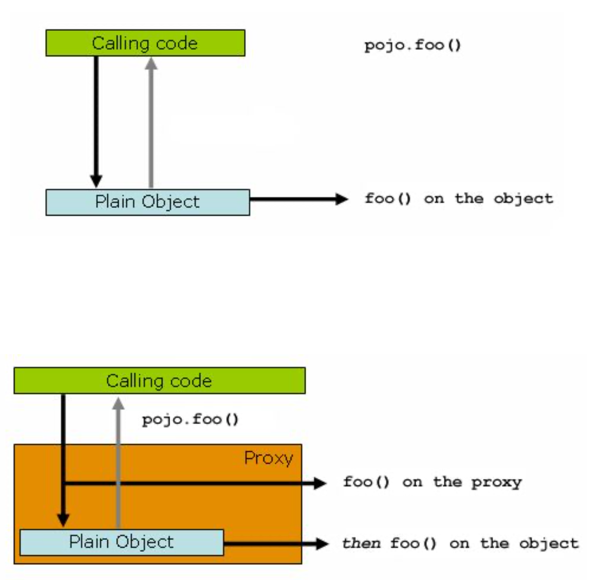

class: center, middle

# Aspect Oriented Programming in Spring

by Jakub Nabrdalik

---

## When will this method be called?

```java
@Aspect
public class BeforeExample {
	@Before("execution(* com.xyz.myapp.dao..(..))") 
	public void doAccessCheck() {
	// ... }
}
``` 

---

### Aspect

Concept shared between other classes.

Example
- transaction management logging
- security

---

### Advice

Tells us, what to do, when something else is done.

Example: when we access the database, a transaction is opened before we do it, and commited or rolled back after we do it.

---

### Join Point

The place where we want Advice to do its job. 

Example: execution of a method.

---

### Pointcut

A predicate that matches Join Points. 

Example: all public methods on services.

---

### Target object

The object being advised. 

Example: our service, a facade.

---

### Weaving

Linking aspects with other application types or objects to create an advised object.

- compile time weaving (AspectJ compiler)
- load time (using JVM agent)
- at runtime (proxies: default for Spring AOP)
 
---

### AOP Proxy

an object created by the AOP framework in order to implement the aspect contracts

---

## AspectJ or Spring AOP weaving?

If you only need to advise the execution of operations on Spring beans, then Spring AOP is the right choice.

If you need to advise objects not managed by the Spring container (such as domain objects typically), then you will need to use AspectJ.

---

## Spring AOP

You can declare aspects either in XML, or using AspectJ annotations (event if you are not using AspectJ weaving).

---

### Runtime Weaving

proxies, proxies everywhere

---
class: center, middle

 

---

## AspectJ annotation based setup

```java
@Configuration
@EnableAspectJAutoProxy
public class AppConfig { }
```

---

## AspectJ annotations

```java
@Component
@Aspect
public class BeforeExample {
	
	@Pointcut("execution( com.xyz.someapp.dao..(..))")
	public void dataAccessOperation() {} 

	@Before("com.xyz.myapp.BeforeExample.dataAccessOperation()") 
	public void doAccessCheck() {
		// do somerhing here }
	}
```

--

Common mistake (at least mine)

I have an aspect. But I have not registered it.

@Aspect does not register the class in Spring Container. You have to register it yourself.

--

Small tip: Even if you are using Groovy, write Aspects in Java. You will have nice IntelliJ IDEA support.

---

## Keeping common pointcuts together

```java
@Aspect
public class SystemArchitecture {

	@Pointcut("within(com.xyz.someapp.web..)") 
	public void inWebLayer() {}

	@Pointcut("within(com.xyz.someapp.service..)") 
	public void inServiceLayer() {}

	@Pointcut("within(com.xyz.someapp.dao..)") 
	public void inDataAccessLayer() {}

	@Pointcut("execution( com.xyz.someapp.service..(..))") 
	public void businessService() {}

	@Pointcut("execution( com.xyz.someapp.dao..(..))")
	public void dataAccessOperation() {} }
```

---

## Pointcuts: examples

```java
execution(public * *(..))

execution(* set*(..))

execution(* com.xyz.service.AccountService.*(..))

execution(* com.xyz.service..(..))

target(com.xyz.service.AccountService) 

@annotation(org.springframework.transaction.annotation.Transactional) 
bean(*Service)
``` 

---

## Advice types

```java
@Before("...")
public void doAccessCheck() {

@AfterReturning("...")
public void doAccessCheck() {

@AfterReturning(pointcut="...", returning="retVal")
public void doAccessCheck(Object retVal) {

@AfterThrowing("...")
public void doRecoveryActions() {

@AfterThrowing(pointcut="...", throwing="ex")
public void doRecoveryActions(DataAccessException ex) {

@After("...")
public void doReleaseLock() {
```