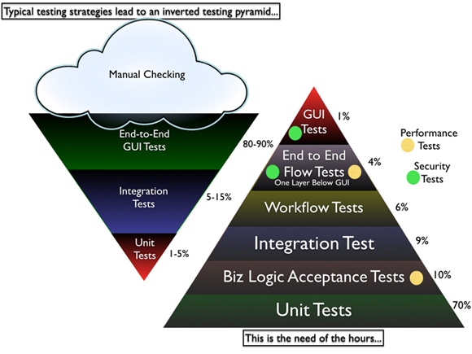
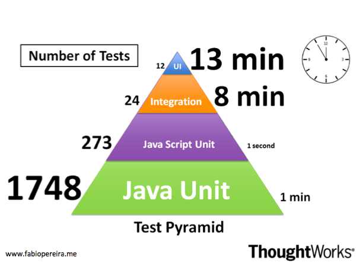

class: center, middle

# TDD & BDD

# Domain Driven Design

by Jakub Nabrdalik

---

# whoami

jakub nabrdalik

solution architect & mentor @bottega

details: **solidcraft.eu**

linkedin: pl.linkedin.com/in/jnabrdalik

Test Driven Development since 2005

18 years in software dev as a Solution Architect, Software Architect, Team Leader, Head of IT, Developer, Analyst

banking, fintech, ecommerce, telco, energy, startups

From 3 man-month systems to 200+ dev monoliths to 700+ microservices

more than 100 talks at conferences, groups etc. 90+ workshops

ex WJUG, WGUG leader, in programme committee 4 DevoxxPL, etc.

---

# who are you?

What's your name?

What do you do?

What's your experience with testing?

What's your experience with Domain Driven Design?

What's your experience with Hexagonal Architecture?

What do you expect from this training?

---

# Sources

Test Driven Development by Example (Kent Beck)

Growing Object-Oriented Software, Guided by Tests (Steve Freeman, Nat Pryce)

https://leanpub.com/badtestsgoodtests (Tomek Kaczanowski; free)

16 years of experience using TDD/BDD

Domain-Driven Design: Tackling Complexity in the Heart of Software (Eric Evans)

https://www.infoq.com/minibooks/domain-driven-design-quickly (InfoQ)

---

# Test / Behaviour Driven Development

- [part 1: why, how, what for](part1.html)

- [part 2: designing test cases](part2.html)

- [part 3: anatomy of a test](part3.html)

- [part 4: setup & cleanup](part4.html)

- [part 5: testing in isolation](part5.html)

- [part 6: organizing tests](part6.html)

- [part 7: architecture and tests](part7.html)

- [part 8: TDD vs BDD vs QA](part8.html)

---

# Getting ready for DDD

- [part 9: Defensive & Offensive programming, Fluent interface](part9.html)

# Domain Driven Design

- [part 10: Domain Driven Design concept](dddconcept.html)

- [part 11: Building blocks](dddbuildingblocks.html)

- [part 12: Medium scale building blocks](mediumScaleBuildingBlocks.html)

---

class: center, middle

# why, how, what for

---

## the goal

What can tests give us?

---

## safety

--

I am not afraid to change code, because tests will catch my bugs

--

Fear is the mind killer

People who are afraid of change, change nothing

> Why do most developers fear to make continuous changes to their code? They are afraid they’ll break it! Why are they afraid they’ll break it? Because they don’t have tests.

> Robert C. Martin, The Clean Coder

--

Sometimes you can just go and break things. When human life or business existance is in danger, you need things tested well

---

## communication

--

How do you know what and why the system does? Where do you keep system requirements?

--

All system change. How long is documentation up to date?

--

What can analysing your code tell you about the system?

--

Will it tell you what were the requirements? What works and why?

--

Automated tests are the only source of truth about what and why. This is the "living-documentation".

> The unit tests are documents. They describe the lowest-level design of the system. 

> Robert C. Martin, The Clean Coder

--

These days even docs are often produced using tests (vide: Spring docs)

--

Q - What is more important: production code or tests?

--

A - You can recreate software based on tests, but you cannot recreate software based on production code, because you don't know if its behaviour is a bug or a feature

---

## feedback

If I code a new feature, how long does it take to see if/how it works

- using manual testing?

--

- using automated testing on running application?

--

- using unit tests?

--

Feedback is crucial. WYSWIG, Operating Systems, Displays, half of the inventions in computer science are about providing feedback faster

Observe-Orient-Decide-Act loop

---

## design

--

When I start with a test for my unit, I start with using my unit first. Therefore I learn how to make it usable

--

By starting with a test, I have to think about what I need to achieve first, and the consequences (corner cases)

--

Design here means: API design, code design, small architecture etc.

a.k.a: eat your own dog food 

--

But that implies, a test have to be written BEFORE the code tested

---

## who started

Who started writing tests before the production code?

--

Alan Jay Perlis in 1968, stated 

> A software system can best be designed if the testing is interlaced with the design instead of being used after the design

effectively describing Test Driven Development

--

In case you don't know who Alan Jay is

- Ph.D. (1950) in mathematics at MIT 
- developed the ALGOL programming language
- awarded the Turing Award in 1966
- moved to the Carnegie Institute of Technology in 1956, where he was chair of mathematics and then the first head of the Computer Science Department
- elected president of the Association for Computing Machinery in 1962

--

Tom Gilb said that NASA started writing tests before code in 60's, and he is old enough (born 1940) for me to believe him

---

## savings

--

How much does maintenance (running, operating, fixing bugs, adding features) cost, compared to the price or creating the software?

--

> The majority of the cost of a software project is in long-term maintenance.

> Robert C. Martin

--

If we can improve quality (reduce maintenance) by 50%, by increasing development time by 15%, there is a huge saving

--

Test Driven Development is catching bugs before they occur

--

Tom Gilb @ Boeing.

---

## what is the goal again?

- safety 
- communication
- feedback
- design
- savings

Tests are only the road to those goals, and not the only one

---

## How do we test

### manual testing

advantages

--

- cheap
- requires no changes in process

--

disadvantages

--

- too slow
- not maintenable (does not scale)
- humans are bad at boring repeating processes, computers excel at those

---

## How do we test

### testing on users

--

If you have a monopoly, you can behave like Microsoft

What was common for Windows 95/Millenium/Vista/8??

--

Every second version of Windows was the correct one. Every first was just a test on real users

--

How did Github use twitter to test their code?

--

By analyzing hate on twitter after deployment

Corporate customers get features tested by free users

--

Steam early access: manual testers for free

---

## How do we test

### probability analysis and redundancy

--

Imagine you had to develop a system for human landing on Mars. If your software fails, people will die, lots of money will dissapear, political crisis will start, and humanity will not have another chance for the next 50 years.
How would you ensure the system does not malfunction?

--

Two or three systems run at the same time. 

Another system analyses output of both and decides which system makes correct decisions

--

Nasa wrote the same software internally, that they bought from IBM, and had a switch in the spaceship, in case IBM screws up

(According to Tom Gilb)

---

## How do we test

### automated test AFTER the code is written

Advantages

--

- same as manual testing
- computers excel at repeating processes

--

Disadvantages

--

- automation can be tricky
- automation can be boring
- testers who can't code lose their jobs
- provides only safety and communication
- when requirements change, long feedback loop

---

## How do we test

### writing tests BEFORE the code by QA

Advantages

--

- safety 
- communication
- design

--

Disadvantages

--

While production code gets written we discover things that have impact on our assumptions and may change our requirements

--

But the process means it would need to go back to QA/analysis, so it rarely happens

--

Instead developers just "do their job" without picking low-hanging fruits, or sharing their discoveries. Business opportunities are lost

---

## How do we test

### writing tests BEFORE the code by developer

a.k.a. Test Driven Development

--

Advantages

- safety 
- communication
- feedback
- design
- savings
- huge impact on the business (Software Development is a learning process)

--

Disadvantages

--

- you need to rewire your brain
- changes the role of QA in organizations

---

## warning

For the rest of this workshop, we will look at tests from the perspective of building, delivering and operating software

Not from QA perspective alone

Not from a programmer perspective alone

Not from a system engineer perspective alone

---

## Types of tests

--

- acceptance
- integration
- unit
- regression
- performance
- penetration/security
- A/B testing
- ...

---

## Test pyramid

--

Why do we need much more unit tests than GUI tests?

---

## Test pyramid

- unit tests run in miliseconds (max 30 seconds)
- integration tests run in seconds (max 3 minutes)
- GUI tests run in tens of seconds (always too long)

--

One company from Cracow concluded

- if tests take <30 sec. devs run them all the time
- if tests take <3 min, devs run them before push to repo
- if tests take >3 min, devs never run them (CI fails)

--

How many test can you run in 30 sec?

--

If you do not touch I/O, and stay in memory/cpu?

--

The company from Cracow had ~3k test run <30 sec

--

Can you be 100% sure everything works, when you don't touch I/O?

--

No. But you can be 80% sure, and that's not bad

---

## Test pyramid @Thoughtworks

---

### next [part 2: designing test cases](part2.html)

