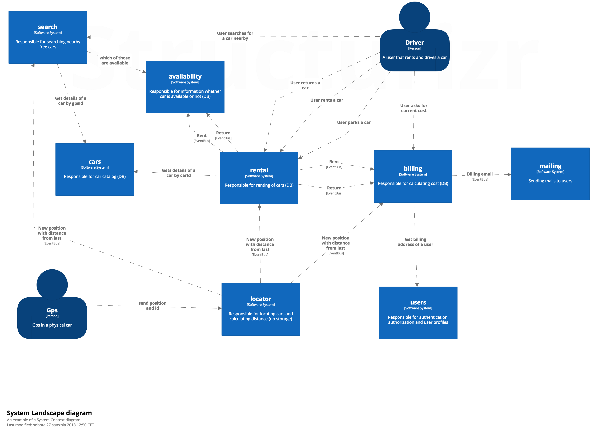
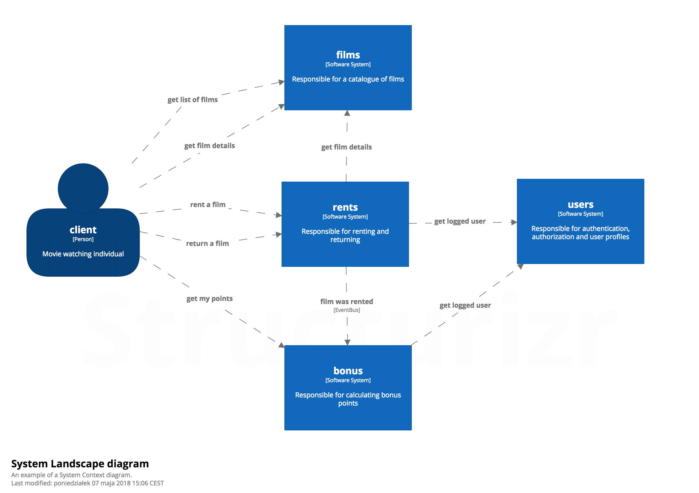

class: center, middle

# Architecture and tests

by Jakub Nabrdalik

---

> A system that is comprehensively tested and passes all of its tests all of the time is a testable system. That’s an obvious statement, but an important one. Systems that aren’t testable aren’t verifiable. Arguably, a system that cannot be verified should never be deployed.

> Robert C. Martin, Clean Code: A Handbook of Agile Software Craftsmanship

---

> The belief that complex systems require armies of designers and programmers is wrong. 
A system that is not understood in its entirety, or at least to a significant degree of detail by a single individual, should probably not be built.

> Niklaus Wirth

---

## bad architecture 

--

Integration testing only (old JEE style)

Unit tests per class + too many mocks (refactoring breaks unrelated tests)

Super slow unit testing (Grails 1/2)

Big ball of mud

---

## good architecture

When you are choosing a technology, verify that you can write and run unit/integration/acceptance tests very fast. Compary which technology gives faster feedback

Frontend technologies prefer unit testing without a browser (on node.js for example)

For backend technologies, the idea is that unit tests should run in miliseconds. Integration test should not rely on servers, and should run in seconds

If it is awkward to write tests, or tests are slow, drop the technology or achitecture

A popular design choice for business applications, is to make the whole domain (business logic) depend only on the basic technology (pure Java for example) and thus be able to have ultra-fast unit tests

We will look at a popular example of a testable architecture, based on ideas and language created by Eric Evans in his boook "Domain Driven Design"

---

## Domain Driven Design

We will talk about details later, but for now, we will use a just one concept: the Bounded Context

---
class: center, middle


---
class: center, middle

## Test too low

(unit testing methods & classes)


---

## Test too low

class api change = lots of tests break

refactoring = lots of tests break

add a feature = lots of tests break

it doesn't work on production anyway

you are testing the implementation, while you'd rather know if the system still works as expected (behavior)

---

class: center, middle

## Test too high

(system as a whole, via UI or API)


---

## Test your modules



---

## What's a module?

A module encapsulates its data (access only via API)

A module has clerly defined collaborators and APIs

Has (almost) all layers (vertical slicing)

Very much like a microservice candidate

Most likely a Bounded Context (words have their own definitions/classes)

---

## Test your modules

as black boxes

all flows and corner cases in milliseconds (no I/O)

add crucial-paths-that-bring-money with I/O

---

### Renting and returning a film in 1990



---

### Start unit testing the module via API

```groovy
class FilmSpec extends Specification {
    FilmFacade facade = new FilmConfiguration().filmFacade()
```
--
```groovy
    FilmDto trumper = createFilmDto("50 shades of Trumpet", FilmTypeDto.NEW)
    FilmDto clingon = createFilmDto("American Clingon Bondage", FilmTypeDto.OLD)
```

--
```groovy
    def "should get a film"() {
        when: "we add a film"
            facade.add(trumper)

        then: "system has this film"
            facade.show(trumper.title) == trumper
    }
```
---
```groovy
    def "shoud list films"() {
        given: "we have two films in system"
            facade.add(trumper)
            facade.add(clingon)

        when: "we ask for all films"
            Page<FilmDto> foundFilms = facade.find(new PageRequest(0, 10))

        then: "system returns the films we have added"
            foundFilms.contains(trumper)
            foundFilms.contains(clingon)
    }

    private FilmDto createFilmDto(String title, FilmTypeDto type) {
        return FilmDto.builder().title(title).type(type).build()
    }
}
```

---

### GREEN + REFACTOR

```Bash
ls  classic/src/main/java/eu/solidcraft/film/

Film.java                   
FilmCreator.java            
FilmType.java
FilmConfiguration.java      
FilmFacade.java             
InMemoryFilmRepository.java
```

---

```Java
class InMemoryFilmRepository {
    private ConcurrentHashMap<String, Film> map = new ConcurrentHashMap();

    Film save(Film film) {
        requireNonNull(film);
        map.put(film.dto().getTitle(), film);
        return film;
    }

    Film findOneOrThrow(String title) {
        Film film = map.get(title);
        if(film == null) {
            throw new FilmNotFoundException(title);
        }
        return film;
    }

    void delete(String title) {
        map.remove(title);
    }

    Page<Film> findAll(Pageable pageable) {
        List<Film> films = new ArrayList<>(map.values());
        return new PageImpl<>(films, pageable, films.size());
    }

    class FilmNotFoundException extends RuntimeException {
        public FilmNotFoundException(String title) {
            super("No film of title \"" + title + "\" found", null, false, false);
        }
    }
}
```

---

### Module configuration so far

```java
class FilmConfiguration {

    FilmFacade filmFacade() {
        FilmRepository filmRepository = new InMemoryFilmRepository();
        FilmCreator filmCreator = new FilmCreator();
        return new FilmFacade(filmRepository, filmCreator);
    }
}
```

That was fast & easy

Runs in milliseconds

We have validated whether the idea makes sense 

We have the core of the code done well

We can add as many corner cases as we want

Now let's add IO

---

### Add Integration spec

```Java
class FilmControllerAcceptanceSpec extends IntegrationSpec implements SampleFilms {
    @Autowired FilmFacade filmFacade

    @WithMockUser
    def "should get films"() {
        given: 'inventory has two films'
            filmFacade.add(trumper, clingon)

        when: 'I go to /films'
            ResultActions getFilms = mockMvc.perform(get("/films"))
        then: 'I see both films'
            getFilms.andExpect(status().isOk())
                .andExpect(content().json("""
                {
                    "content": [
                        {"title":"$clingon.title","type":"$clingon.type"},
                        {"title":"$trumper.title","type":"$trumper.type"}
                    ]
                }"""))

        when: 'I go to /film/'
            ResultActions getFilm = mockMvc.perform(get("/film/$clingon.title"))
        then: 'I see details of that film'
            getFilm.andExpect(status().isOk())
                .andExpect(content().json("""                        
                    {"title":"$clingon.title","type":"$clingon.type"}"""))
    }
}
```

---

### Add IO

```Java
@RestController
@AllArgsConstructor
class FilmController {
    private FilmFacade filmFacade;

    @GetMapping("films")
    Page<FilmDto> getFilms(Pageable pageable) {
        return filmFacade.findAll(pageable);
    }

    @GetMapping("film/{title}")
    FilmDto getFilm(@PathVariable String title) {
        return filmFacade.show(title);
    }
}
```

```Java
interface FilmRepository extends Repository<Film, String> {
    Film save(Film film);
    Film findOne(String title);
    void delete(String title);
    Page<Film> findAll(Pageable pageable);
}
```

---

### IO Configuration

```java
@Configuration
class FilmConfiguration {

    FilmFacade filmFacade() {
        return filmFacade(new InMemoryFilmRepository());
    }

    @Bean
    FilmFacade filmFacade(FilmRepository filmRepository) {
        FilmCreator filmCreator = new FilmCreator();
        return new FilmFacade(filmRepository, filmCreator);
    }
}
```

---

## Do not let the IO out

What will happen if you require Mocks/Stubs for IO, by giving developers this method for unit tests?

--

```java
@Bean
FilmFacade filmFacade(FilmRepository filmRepository) {
    FilmCreator filmCreator = new FilmCreator();
    return new FilmFacade(filmRepository, filmCreator);
}
```

--

```java
InMemoryFilmRepository filmRepository = Mock()
//or
InMemoryFilmRepository filmRepository = new InMemoryFilmRepository()
...
FilmFacade filmFacade = new FilmConfiguration().filmFacade(filmRepository)
```

People will test via verifying on IO (repository mock/stub, etc.), because they have it at hand

This will check internal state of the module, instead of testing the behaviour

---

## Module boundaries

What will happen if you allow them to inject only OTHER modules?


---

## Module boundaries

```java
abstract class ArticleDomainSpec extends Specification {
    SearchFacade searchFacade = Mock()
    PromotedArticleFacade promotedArticleFacade = Mock();

    ArticleFacade articleFacade = new ArticleConfiguration().articleFacade(
            searchFacade,
            promotedArticleFacade,
    )
}
```

--

People start testing BEHAVIOUR of a module, because they have no access to internal state

That's Behaviour Driven Developemnt

You should go further from that (events)
https://github.com/olivergierke/sos

---

## Too much distraction

keep information to minimum

only important, meaningful information

what would you write to explain this to me

hide everything else

---

```Groovy
def "should find images by category"() {
  given: "image in category X"         
    NewImageDto xCategoryImage = newImageDto([
            categories: [new Category("tree1", X, "AliasX")],
            originalFileName: "rambo-x.jpg"
    ])
    imageStore.upload(imageToUpload(xCategoryImage)) >> Mono.just(uploadedImage())
    extract(imageFacade.save(xCategoryImage))
  and: "there is an image in category Y"
    NewImageDto imageY = inCategory(Y)
    managerHasImage(imageY)

    NewImageDto yCategoryImage = newImageDto([
            categories: [new Category("tree2", "Y", "AliasY")],
            originalFileName: "rambo-y.jpg"
    ])
    
    imageStore.upload(imageToUpload(yCategoryImage)) >> Mono.just(uploadedImage())
    extract(imageFacade.save(yCategoryImage))
  and: "image in category X and Y"
    NewImageDto xyCatcategoryImage = newImageDto([
            categories: [
                    new Category("tree1", X, "AliasX"),
                    new Category("tree2", "Y", "AliasY")],
            originalFileName: "rambo-xy.jpg"
    ])
    imageStore.upload(imageToUpload(xyCatcategoryImage)) >> Mono.just(uploadedImage())
    extract(imageFacade.save(xyCatcategoryImage))
  when: "images are fetched by category X"
    List<ImageDto> fetchedImages = extract(imageFacade.findByCategoryId(X))
  then: "all images from category X can be retrieved"
    fetchedImages.originalFileName == [imageX, imageXY].originalFileName
}
```
---

```Groovy
def "should find images by category"() {
    given: "there are three images: in category X, in Y, in X and Y"
        NewImageDto imageX = inCategory(X)
        NewImageDto imageY = inCategory(Y)
        NewImageDto imageXY = inCategory(X, Y)
        managerHasImages(imageX, imageY, imageXY)

    when: "images are fetched by category X"
        List<ImageDto> fetched = extract(imageFacade.findByCategoryId(X))

    then: "all images from category X were retrieved"
        fetched.originalFileName == [imageX, imageXY].originalFileName
}
```

---

## Implicit vs explicit information

Explicit - what is important for this particular test

Implicit - what can be taken for granted

For every line of test ask yourself: is this crucial to understand the requirement?

--

```Groovy
    given: "there is a film in catalogue"
        Film film = persistedFilms.first()
``` 

--

```Groovy
    given: "there is a new release in catalogue"
      Film film = persistedFilms.find { it.filmType == NEW_RELEASE }
```

--

If there is a lot of logic behind preparing assumptions, move it out

```Groovy
def "should throw exception when trying to get unpublished article"() {
    given: 
        Article unpublishedArticle = createUnpublishedArticle()
```


---

## Sample data for a module

For each module prepare a sample of correct input and output data (DTOs)

Allow the user to alter that input, changing only what's necessary

This makes it trivial to do exploratory testing, test new corner cases, and prohibits test setup explosion

--

For example

```Groovy
given: "new article is prepared"
    NewArticleDto articleToBeCreated = sampleNewArticle()
```

--

```Groovy
given: "new article doesn't have title"
    NewArticleDto articleToBeCreated = sampleNewArticle(title: null)
```

--

```Groovy
given: "new article is in guides space"
    NewArticleDto articleToBeCreated = sampleNewArticle(spaceId: "guides")
```

---

```Groovy
@CompileStatic
class SampleNewArticleDto {
  ...
  
  static NewArticleDto sampleNewArticle(Map<String, Object> properties = [:]) {
   
    //overriding defaults with custom props
    properties = SAMPLE_NEW_ARTICLE_MAP + properties 

    return NewArticleDto.builder()
      .spaceId(properties.spaceId as String)
      .title(properties.title as String)
      .lead(properties.lead as String)
      .leadPhoto(mapNonNull(properties.leadPhoto, { sampleAssetOrSame(it) }))
      ...
      .build()
  }
```

---

```Groovy
  static final Map SAMPLE_NEW_ARTICLE_MAP = [
    "spaceId"     : DEFAULT_ARTICLE_SPACE,
    "title"       : "The Juliette Society review",
    "lead"        : "In her debut erotic novel...", 
    "leadPhoto"   : [
        "url"  : "https://bookcover.com/julietteSoc.png",
        "alt"  : "book cover",
        "title": "Book cover"
    ],
    "content"     : SAMPLE_CONTENT,
    "bioId"       : "1234567890",
    "publishDate" : "2011-12-03T10:15:30Z",
    "tags"        : ["fiction", "review"],
    "metaKeywords": ["meta", "keywords"],
    "categories"  : [
        [
            "treeId": "faq",
            "path"  : [
                ["name": "ABC", "id": "12345", "parentId": null],
                ["name": "DEF", "id": "67890", "parentId": "12345"]
            ]
        ]
    ],
    "adWordsGroup": sampleAdWordsGroupDto()
  ]
```

This also gets serialized to json, for integration tests

---

## Common interactions

Unit testing a module is easy, it has a Java API: just call the facade

What about testing in integration (via HTTP, etc.)?

Extract common interactions, so that it's super easy to reuse


--

```Groovy
class ArticleActionsAcceptanceSpec 
  extends MvcIntegrationSpec 
  implements OperatingOnArticleEndpoint, 
             OperatingOnArticleActionsEndpoint, 
             OperatingOnBioEndpoint {
```

--

```Groovy
  when: "new article is created"
    ResultActions createArticleResult = postNewArticle([bioId: bioId])
```

--

```Groovy
  when: "article's title is updated"    
    ResultActions updateResult = 
        updateExistingArticle(article.id, articleJson(title: "updated title"))
```

--

```Groovy
  when: "article is previewed"
    ResultActions previewArticleResult = preview(article.id, articleJson())
```

---

```Groovy
@SelfType(MvcIntegrationSpec)
@CompileStatic
trait OperatingOnArticleActionsEndpoint extends CommunicatingWithEndpoint {

    ResultActions publish(String articleId, String articleJson) {
      return performAction(articleId, "publish", articleJson)
    }

    ResultActions submit(String articleId, String articleJson) {
      return performAction(articleId, "submit", articleJson)
    }

    ResultActions preview(String articleId, String articleJson) {
        return performAction(articleId, "preview", articleJson)
    }

    //...

    private ResultActions performAction(
        String articleId, 
        String action, 
        String content) {
      return mockMvc.perform(put("/api/article/$articleId/$action")
          .contentType(APPLICATION_JSON_UTF8)
          .content(content)
          .accept(APPLICATION_JSON_UTF8))
    }

```

---

```Groovy
@CompileStatic
@SelfType(IntegrationSpec)
trait CommunicatingWithEndpoint {
    abstract MockMvc getMockMvc()

    JsonSlurper slurper = new JsonSlurper()

    Object getObjectFromResponse(ResultActions response) {
        return slurper.parseText(response.andReturn().response.contentAsString)
    }

    ResultActions performGet(String path) {
        return mockMvc.perform(get(path)
            .accept(APPLICATION_JSON_UTF8))
    }

    ResultActions performAsyncGet(String path) {
        MvcResult mvcResult = mockMvc.perform(get(path)
            .accept(APPLICATION_JSON_UTF8))
            .andReturn()
        return mockMvc.perform(asyncDispatch(mvcResult))
    }

    ResultActions performAsyncGet(URI uri) {
        MvcResult mvcResult = mockMvc.perform(get(uri)
            .accept(APPLICATION_JSON_UTF8))
            .andReturn()
        return mockMvc.perform(asyncDispatch(mvcResult))
    }
}
```

---

Do not make a developer think AGAIN about
- what endpoint should I hit
- what protocol should I use
- what HTTP method should I use
- what payload should I send
- how to serialize that payload
- how to deserialize the response
- async or sync

Answered only once

Give meaningful names to interactions with you API

--

What happens if you don't do it?

People will duplicate the code, take more time, and make mistakes

---

Make it super easy to test and explore your module

```Groovy
def "publish article successful flow"() {
    when: "new bio is created"
        ResultActions postBioResult = postNewBio(newBio())
    ...
    when: "new article is created"
        bioId = getObjectFromResponse(postBioResult).id
        ResultActions createArticleResult = postNewArticle([bioId: bioId])
        article = parseJsonResponse(createArticleResult, ArticleQueryDto)
    ...
    when: "article's title is updated"
        String updatedTitle = "updated title"
        ResultActions updateResult = 
            updateExistingArticle(article.id, articleJson(title: updatedTitle))
    ...
    when: "article is previewed"
        article = parseJsonResponse(updateResult, ArticleQueryDto)
        ResultActions previewArticleResult = preview(article.id, articleJson())
    ...
    when: "editor submits article"
        article = parseJsonResponse(previewArticleResult, ArticleQueryDto)
        signIn(TEST_EDITOR)
        ResultActions submitResult = submit(article.id, articleJson())
    ...
    when: "article is published"
        article = parseJsonResponse(submitResult, ArticleQueryDto)
        ResultActions publishResult = publish(article.id, articleJson())
}
```

---

## Show, don't tell

What is the fastest way to learn/understand a requirement?

--

If you were at a whiteboard, explaining to me what's going on, what would you write or draw?

Can you do the same in test?

How close can you get?

---

### Adding category to a tree

---

```Groovy
def "should add a new category"() {
  given: "user wants to add a new category"
    AddNewCategoryDto addNewCategory = new AddNewCategoryDto(C.id, "New Category", "new-category", 1)
    TreeChangesDtoWithoutId treeChanges = new TreeChangesDtoWithoutId([addNewCategory], savedTree.version)
  when: "new category is added under category C"
    ResultActions result = putCategoryTreeChanges(savedTree.id, treeChanges)
  then: "response contains updated tree with new category"
    CategoryTreeDto updatedTree = parseJsonResponse(result, CategoryTreeDto)
    CategoryWithSubtreeDto newCategory = updatedTree.getCategoryByAlias(addNewCategory.alias)
    newCategory != null
    newCategory.alias == addNewCategory.alias
    newCategory.name == addNewCategory.name
  and: "new category is a child of a category C"
    CategoryWithSubtreeDto parent = updatedTree.getCategoryById(C.id)
    parent.children.contains(newCategory)
  and: "new category is on the correct position between categories E, F"
    parent.children[addNewCategory.position] == newCategory
  and: "updated tree version is incremented"
    updatedTree.version == savedTree.version + 1
  and: "other tree parameters remained unchanged"
    expectCategoryTreeDto(updatedTree)
        .expectSuperTreeOf(treeInput)
  and: "new category is available for other users"
    fetchCategoryByAlias(savedTree.id, addNewCategory.alias)
      .andExpect(status().isOk())
}
```

--

Is this how you'd explain this to me?

Or would you draw two pictures: a tree before, and after?

---

To test adding a new category, let's start with declaring a tree

```Groovy
CategoryNode root =
    A (
        B,
        C (E, F),
        D
    )
```

--

```Groovy
def "should add a new category"() {
    given: "user wants to add under C a new category G at position 1 
        AddNewCategoryDto addNewCategory = C + G.at(1)
```

--

```Groovy
    when: "new category is added"
        TreeDto updatedTree = modifyTree(addNewCategory)
```

--

```Groovy    
    then: "updated tree contains new category"
        TreeDto expected = expectedTree(
            A (
                B,
                C (E, G, F),
                D
            )
        )
        updatedTree == expected
}
```

---

WTF is this?

```Groovy
CategoryNode root =
    A (
        B,
        C (E, F),
        D
    )
```

--

Oh, it's a simple method call in groovy

```Groovy
class CategoryNode {
    static final CategoryNode A = new CategoryNode("A") //B,C, etc...
    
    final String id
    final List<CategoryNode> children

    //in groovy, a method without a name on an object is 'call'
    CategoryNode call(CategoryNode... children) {
        return new CategoryNode(id, name, alias, children.toList())
    }
    ...
}
```

---

How to achieve this?

```Groovy
AddNewCategoryDto addNewCategory = C + G.at(1)
```

--

Operator '+' is also a method named 'plus'

```Groovy
class CategoryNode {
    ...

    //overriding + operator in groovy
    AddNewCategoryDto plus(CategoryNode node) {
        return new AddNewCategoryDto(this.alias, node.name, node.alias)
    }

    //and now let's handle the position
    static class CategoryNodeAtPosition {
        CategoryNode node
        int position
    }

    CategoryNodeAtPosition at(int position) {
        return new CategoryNodeAtPosition(this, position)
    }
}    
```


---

How to describe moving a category?

```Groovy
    CategoryNode root =
            A (
                B,
                C (
                    E,
                    F
                ),
                D
            )
```

--

```Groovy
    def "should move category under different category"() {
        when:
            TreeDto updatedTree = modifyTree(B >> F)
```


--

```Groovy
        then:
            TreeDto expected = expectedTree(
                A (
                    C (
                        E,
                        F (
                            B
                        )
                    ),
                    D
                )
            )
            updatedTree == expected
    }

    //The '>>' operator in groovy is just a method called 'rightShift'
```

---

What if I have a lang without operator overriding

```Groovy
    CategoryPathDto pathToC1 = path(C1)
    CategoryPathDto pathToC2 = path(C1, C2)
    CategoryPathDto pathToC3 = path(C1, C2, C3)
    CategoryPathDto pathToB2 = path(C1, B2)
    CategoryPathDto pathToB3 = path(C1, B2, B3)
    CategoryPathDto pathToD3 = path(C1, B2, D3)

    ArticleQueryDto AC1, AC2, AC3, AB2, AB3, AD3

    //@Before prepareInitialArticles() ommited
```

--

```Groovy
    def "should update all articles with changed categories in given space"() {
        given: "C2 was moved under B2"
            CategoryPathDto from = pathToC2
            CategoryPathDto to = path(C1, B2, C2)

        when: "we update articles"
            execute(facade.updatePath(from, to, DEFAULT_ARTICLE_SPACE))
```

--

```Groovy
        then: "AC3 moved to C1->B2->C2->B3"
            currentPathFor(articles.AC3) == path(C1, B2, C2, C3)

        and: "AC2 moved to C1->B2->C2"
            currentPathFor(articles.AC2) == path(C1, B2, C2)

        and: "all other articles have not moved"
            pathsHaveNotChangedFor(articles.allExcept(articles.AC2, articles.AC3))
    }

```

---

## How would you test car location search?

Perhaps you cannot draw a map in code (ASCII art could be a little overkill) but we can talk about points on the map

--

```Groovy
def "should return locations of nearest cars"() {
    given: "there are cars A(2,2), B(1,1), C(2,2), D(400,400)"
        A = car(2,2); B = car(1,1); C = car(2,2); D = car(400,400)
        locationsDetected(A, B, C, D)
        registered(A, B, C, D)

    and: "A, B are available"
        available(A, B)

    when: "user searches for cars nearby by sending his location (lat/lon)"
        carsFound = findCarsNearby(0, 0)

    then: "system returns [B, A] (sorted by distance)"          
        carsFound.carId == [B, A].carId
```

---

## Whiteboard approach

Think about how would you explain this to to another personon using a whiteboard 

See if you can do that in code

Don't be afraid of creating a little Domain Specific Language for testing your module

If it simplifies expressing the requirements, it's worth it

---


> It seems that perfection is attained not when there is nothing more to add, but when there is nothing more to remove.

> [Antoine de Saint Exupéry]

---

## Monolith

With large applications, we hit a performance/feedback problem

- large codebase takes minutes to compile

--

- large codebase take minutes to pass all tests, even with good architecture

--

- the size of the codebase implies there is not a single developer that understands it anymore

--

- in fact you can understand just a few Bounded Contexts before your head explodes

--

- and large number of commits per day, doesn't help

--

- that too many people have to coordinate/communicate, thus slowing progress down

--

- finally, it's practically impossible to keep self-discipline, and thus quality in 100+ dev group--

---

## Microservices

> Inside every large program, there is a small program trying to get out.

> C.A.R. Hoare

--

> Microservices are a more concrete and modern interpretation of service-oriented architectures (SOA) used to build distributed software systems.

--

> allows the architecture of an individual service to emerge through continuous refactoring, hence reduces the need for a big up-front design and allows for releasing the software early and continuously.

---

## Microservices

- Distributed/versioned configuration

- Service registration and discovery

- Routing

- Service-to-service calls

- Load balancing

- Circuit Breakers

- Distributed messaging

- Distributed logging

- Deployment infrastucture (docker/mesos/cloud foundry)

- There are already frameworks to cover a lot of that (e.g.: Spring Cloud)

---

## Testing distributed systems

--

- end-2-end tests
- testing each component alone
- testing on production
- consumer driven contracts
- NASA style

---

## end-2-end tests

Test of a whole distributed system, on a dedicated environment

--

Advantages

- tells you if all components talk work together

--

Disadvantages

- very slow to setup and run
- you have to deploy all apps in specific version (same as on production) at once
- you have to coordinate production releases (once a week for example)
- you still do hardly ever test it on the same hardware/network setup, so it can still fail on production

---

## testing each component alone

--

Advantages

- fast feedback
- easy to evolve
- fast to go to production
- easy to setup

--

Disadvantages

- you don't know if it works with other services

--

This one you have to do either way

---

## testing on production

Focusing on logging, metrics, monitoring

--

Advantages

- you test your system on real hardware/network
- easy to setup

--

Disadvantages

- you will fail a lot, customers will not be happy

--

To mitigate customers not being happy you do

- continuous delivery
- contituous deployment
- A/B testing, blue-green deployment, 1%-5%-10%-50%-100% deployment
- automatic rollback (tricky to implement with data migration)
- feature toggles

---

## consumer driven contracts

Define a contract between microservices. Test that contract on server and clients. Changes require testing again

Swagger for defining contracts 

Pact.io or Spring Cloud Contract for CDC

--

Advantages

- mitigates errors due to bad communication
- makes developers aware of backward compatible changes

--

Disadvantages

- tooling doesn't support event bus well (docs suck but it works!)
- may be hard to convince all the other teams
- does not test hardware/networking/performance problems


---

## NASA style 

--

As described by Tom Gilb

For systems that are crucial, create those services two or three times, by different teams, preferably in different technologies

Run all 3 in parallel

Create a validation system, that compares outputs from 3 source systems, and decides which is right (2 of 3 are right, probability of correct answer, etc.)

---

### [part 8: TDD vs BDD vs QA](part8.html)
